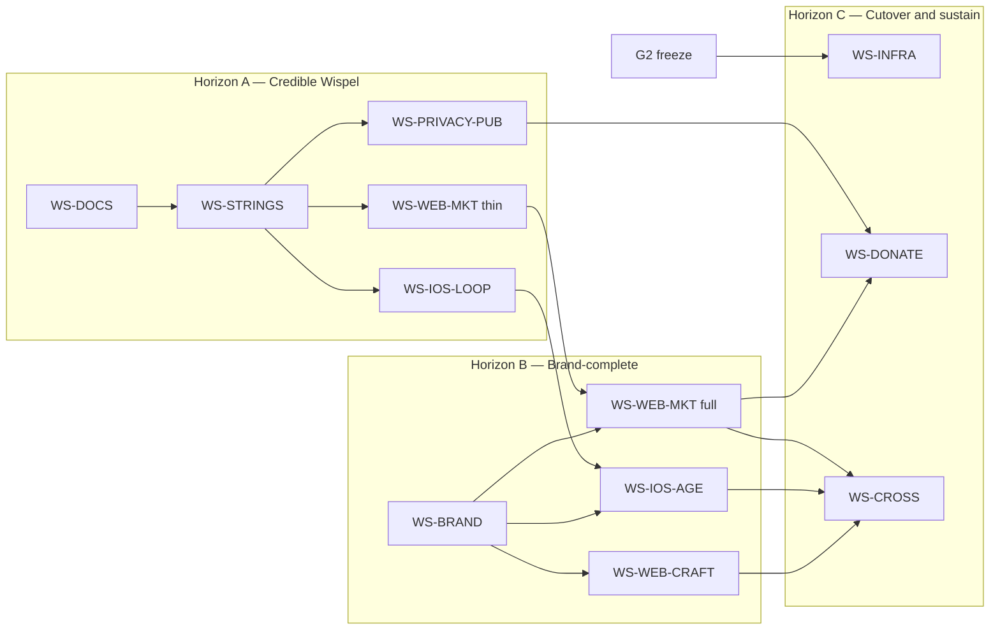

# Wispel — build plan & workstreams

**Status:** planning — companion to [`wispel-rebrand-and-ui-plan.md`](./wispel-rebrand-and-ui-plan.md)  
**Audience:** eng + design leads  
**Stance:** critical. Prefer shipping a coherent free, privacy-first Wispel over boiling the ocean.

**Locked:** privacy first · free for families · donations (parent-only) · product name Wispel · domain `wispel.cc`

---

## 1. Critical verdict (read this first)

The strategy plan is directionally right. As a **build** plan it is still too wide if taken as one release.

| Reality | Implication |
| --- | --- |
| Parent web + API are mature; marketing is absent | Marketing is net-new, not a polish pass |
| iOS redeem/pin **API exists**; shop UI does not | Highest leverage product work — ship before mascot art |
| No payment stack | Donations are a **separate** workstream with legal gate — do not block MVP ship on Stripe |
| Brand assets do not exist | You cannot parallelize “final” marketing + iOS chrome until Phase 0 artifacts exist |
| Token files are duplicated (`globals.css` ↔ Design System) | One owner for brand tokens or every UI PR conflicts |
| Worker/D1 rename touches CI hardcodes | Infra rename is a **cutover weekend**, not a parallel stream |
| Productvoorstel freemium language | ✅ Fixed in WS-DOCS (ADR-0005); keep watch for regressions |

**Ship philosophy:** three horizons, not one mega-release.

1. **Horizon A — Credible Wispel** (name + privacy story + free CTA + iOS shop loop)  
2. **Horizon B — Brand-complete surfaces** (real mark, landing depth, parent web craft)  
3. **Horizon C — Cutover & sustain** (DNS/Workers rename, donations live, kits synced)

If Horizon A slips because someone is redesigning avatars or renaming `apps/ios/TaakHelden/`, the plan has failed.

---

## 2. Gates (non-negotiable)

### Gate G0 — Brand lock (blocks Horizon B “final” UI; does **not** fully block Horizon A engineering)

| Must decide | Minimum bar |
| --- | --- |
| Vocabulary replacing “TaakHeld” | Wispel-native; **no Held/Hero** |
| Parent / kid / teen palette | Hex signed off; cream+#blue ChoreHero twin rejected |
| Wordmark direction | Even a temporary SVG mark OK for A; final mark for B |
| Privacy one-liner + free one-liner | NL + EN, marketing-ready |
| Subdomain hosting | **Decision:** marketing in same Next app vs separate — see WS-WEB-MKT |
| Bundle ID strategy | Keep `nl.taakhelden.*` if App Store record exists; else `cc.wispel.family` |

### Gate G1 — Legal/privacy for public site

| Must have | Why |
| --- | --- |
| Public `/privacy` + `/voorwaarden` draft | App Store + trust; plan already requires them |
| Donation **provider + legal entity** | Only before WS-DONATE coding — not before Horizon A |
| DPIA progress | Blocks **production child photos**, not local/dev |

### Gate G2 — Feature freeze before infra cutover

No feature PRs merging into `main` during WS-INFRA rename window.

---

## 3. Horizon map

---

## 4. Workstream catalog

| ID | Name | Horizon | Owner archetype | Parallel? |
| --- | --- | --- | --- | --- |
| **WS-DOCS** | Canon & lies cleanup | A | Knowledge / PO | ✅ Done |
| **WS-STRINGS** | User-facing rename | A | Web + i18n + iOS + Backend | ✅ Done (O1=B) |
| **WS-IOS-LOOP** | Shop redeem + spaardoel + Mijn Dag header | A | iOS | After strings freeze *or* with temporary keys |
| **WS-PRIVACY-PUB** | Public privacy/terms + App Store copy | A | Knowledge + Web | ✅ Done (pages); Store nutrition labels draft still open |
| **WS-WEB-MKT** | Marketing site (thin → full) | A→B | Web + Marketing | Thin after strings; full after brand |
| **WS-BRAND** | Tokens, mark, icons, avatar art v1 | B | Design + Web | After G0; single token owner |
| **WS-WEB-CRAFT** | Parent dashboard craft | B | Web | After brand tokens stable |
| **WS-IOS-AGE** | Teen + young pass; Mijn Held badges | B | iOS | After loop; needs brand art ideally |
| **WS-DONATE** | `/steun` + parent settings donate | C | Web + Backend (+ legal) | After provider decision |
| **WS-INFRA** | DNS, Workers, bindings rename | C | DevOps | Serialized cutover |
| **WS-CROSS** | Kits sync, celebration echo, QA | C | Web + iOS + DS | After B surfaces exist |

---

## 5. Workstream specs (critical scope)

### WS-DOCS — Canon cleanup
**Status:** ✅ done (2026-07-30) — productvoorstel, CLAUDE/AGENTS/README, ADR-0005  
**Why first:** Productvoorstel still sold freemium; agents would implement the wrong model.

| In | Out |
| --- | --- |
| Patch productvoorstel §7 → free + donations | Rewriting all historical batch plans |
| Point CLAUDE.md / AGENTS.md / README at Wispel plan | Mass-renaming every `taakhelden-*.md` filename (defer) |
| ADR-0005: free+donations + privacy-first + domain / bundle policy | Full DPIA completion (track separately) |

**DoD:** A new agent reading CLAUDE.md cannot conclude Wispel is freemium. ✅

---

### WS-STRINGS — User-facing rename (Horizon A)
**Status:** ✅ done (2026-07-30) — O1 Option B (Ster/Star); product name Wispel in shipping UI  
**Critical rule:** Rename **what parents/kids see** before renaming folders/Workers.

| In | Out |
| --- | --- |
| `messages/{nl,en}.json`, iOS Localizable, email/push subjects, metadata titles | `apps/ios/TaakHelden/` path rename |
| OpenAPI `info.title` → Wispel (regen) | Wrangler worker name change |
| Login/AppShell wordmark; iOS `CFBundleDisplayName` / `PRODUCT_NAME` | Class names (`TaakHeldenAPIClient`, etc.) |
| Celebration + tabs per O1 **B** (Ster / Star) | JS Design System global id |

**Conflict control:** One PR series owns message keys; other streams rebase.

**DoD:** `rg -i 'TaakHelden|TaakHeld'` has zero hits in user-facing string files. ✅

**Critique:** Doing folder/Worker rename in the same PRs is how CI stays red for a week. Don’t.

---

### WS-IOS-LOOP — Emotional product loop (Horizon A priority #1 for product)
API already supports redeem + pin. UI is browse-only. **This is the highest ROI engineering work in the entire plan.**

| Must ship | Defer |
| --- | --- |
| Redeem CTA + affordability + success/celebration | Custom avatar illustration library |
| Pin spaardoel + ProgressBar “Nog X tot …” | Young near-textless full pass |
| Mijn Dag header: avatar + points + streak | Full teen typography/radius overhaul |
| Empty/error copy Wispel-positive | Widget wiring |

**Files (expected):** `ChildShellView` / shop ViewModel, `FamilyGoal` untouched unless needed.

**Tests:** ViewModel unit tests for redeem/pin optimistic + idempotency key; UI smoke if present.

**DoD:** Child can pin → progress → redeem on device against local API; parent sees redemption on web (existing).

**Critique:** Shipping Mijn Held badges or mascot before redeem is marketing cosplay. Fix the shop.

---

### WS-PRIVACY-PUB — Public privacy (Horizon A)
**Status:** ✅ done for web pages (2026-07-30) — `/privacy` + `/voorwaarden` NL+EN; auth footers linked. App Store nutrition-label draft still open.

| In | Out |
| --- | --- |
| `/privacy`, `/voorwaarden` NL+EN plain language | Full DPIA sign-off (parallel legal track) |
| Auth-page legal links + marketing layout | New analytics product |
| States no ads, no child tracking, EU hosting, free/donations | Changing photo retention policy |

**DoD:** URLs exist in the web app; copy states no ads, no child tracking, EU hosting, free/donations. ✅

**Critique:** “Privacy first” without a public page is a slogan. This is cheaper than brand illustration — do it early.

---

### WS-WEB-MKT — Marketing (thin → full)

#### Thin (Horizon A) — unblock trust + conversion
| In | Out |
| --- | --- |
| `(marketing)` route group, own layout (no AppShell) | Final illustration system |
| Landing: brand (temp mark OK) + promise + **gratis** CTA + privacy blurb + FAQ stub | Pricing table / trial |
| `/privacy`, `/voorwaarden` linked | Comparison SEO library (ChoreHero-scale) |
| Soft “Steun” placeholder → mailto or “binnenkort” if donate not ready | Interactive demo |

#### Full (Horizon B) — after WS-BRAND
| In | Out |
| --- | --- |
| Final mark, expressive type, atmosphere, product screenshots | Cloning ChoreHero section order verbatim |
| How-it-works in Wispel voice; for/not-for; gratis+steun section | Feature laundry (AI/Alexa) |
| Auth branded entry | Kid coral pasted onto parent login |

**Hosting decision (pick one in G0):**

| Option | Pros | Cons |
| --- | --- | --- |
| **A. Same Next app** `(marketing)` + `(dashboard)` | One deploy, shared i18n | Metadata/layout discipline; easier to leak dashboard chrome |
| **B. Separate marketing Worker** | Clear www vs app | Two deploys, duplicate tokens |

**Recommendation:** Option A for Horizon A/B; revisit B only if www/app split becomes operationally painful.

**DoD thin:** `wispel.cc` (or staging) shows gratis + privacy; CTA registers.  
**DoD full:** Passes brand test; no ChoreHero twin look.

**Critique:** Do not wait for mascot to ship a landing. A thin honest landing beats a blank login-as-homepage.

---

### WS-BRAND — Foundation (Horizon B; design-led)
| In | Out |
| --- | --- |
| Final hex in `globals.css` **and** Design System tokens (one PR, one owner) | Shared token npm package extraction mid-flight |
| SVG wordmark + app icon set | Full avatar shop art (v1 subset OK) |
| Chrome icon set (replace emoji in parent chrome first) | Lottie library |

**DoD:** Placeholder comments removed; kits + shipping share same hex; mark used on web auth + marketing + iOS.

**Critique:** Parallel “everyone edits tokens” will thrash. Appoint **one** token owner.

---

### WS-WEB-CRAFT — Parent dashboard (Horizon B)
| In | Out |
| --- | --- |
| Hide or ship Inzichten (hide is fine) | Building full Inzichten analytics |
| Reduce border-box monotony on Vandaag/Goedkeuren | Kid register bleed |
| Primitive consistency (`Button`, kill ad-hoc) | Marketing landing work (belongs in WS-WEB-MKT) |
| 2–3 quiet success motions | Confetti in dashboard chrome |
| Parent settings link to Steun (if donate live) or placeholder | Donation checkout itself |

**DoD:** No stub in primary nav; `/design-check` clean on touched pages.

**Critique:** Craft without brand tokens is polishing the wrong house. Sequence after WS-BRAND.

---

### WS-IOS-AGE — Age modes + Held (Horizon B)
| In | Out |
| --- | --- |
| Teen: radius/type/confetti differentiation | Separate TeenMode screen duplicate |
| Young: enlarge targets, TTS coverage for primary actions | Perfect near-textless (can be B2) |
| Mijn Held: badges/level story | Parent-gate as hero content |

**DoD:** Visual QA checklist signed for mid vs teen; young not marketed until checklist pass.

**Critique:** Easy to gold-plate. Cap scope: teen palette+type+radius; young Speak on all primary CTAs; 3 badges max v1.

---

### WS-DONATE — Sustain (Horizon C)
| In | Out |
| --- | --- |
| External donate page `/steun` (hosted checkout) | In-app IAP donations (Apple tax + complexity) unless required |
| Parent web + iOS parent-mode deep link | Any UI on child tabs |
| Receipt/thank-you; no guilt copy | Feature gates tied to donation amount |

**Hard dependency:** legal entity + provider (Stripe/Mollie/iDEAL).

**DoD:** Parent can donate; child builds with donation strings grepped = zero.

**Critique:** Donations must not delay Horizon A. Mailto/“binnenkort” on thin landing is acceptable.

---

### WS-INFRA — Cutover (Horizon C, serialized)
| In | Out |
| --- | --- |
| DNS `wispel.cc` / `app` / `api` | Rewriting historical D1 migrations |
| Worker rename + service bindings + CI `taakhelden-db` string | Parallel feature merges |
| Apple SIWA redirect URLs | Optional iOS folder rename (separate PR after green) |
| Email from `@wispel.cc` | Renaming every doc filename |

**Runbook:** staging twin → freeze → cutover → smoke auth/register/redeem → rollback aliases retained 48h.

**DoD:** Prod traffic on Wispel hosts; old workers.dev aliases redirect or retire.

**Critique:** Doing this in week 1 is vanity. Do it when product strings and thin marketing already say Wispel.

---

### WS-CROSS — Consistency (Horizon C)
| In | Out |
| --- | --- |
| Update Design System kits to Wispel + mark aspirational gaps | Inventing new product features |
| Parent web quiet celebration echo on approve/fulfill | Full motion design system |
| Screenshot pack for Store + landing | — |

**DoD:** Kits no longer advertise unfinished shop; Store screenshots match shipping app.

---

## 6. Suggested PR sequence (eng)

| Order | PR theme | Workstream |
| --- | --- | --- |
| 1 | Docs: free+donations + privacy canon | WS-DOCS |
| 2 | ADR bundle ID + domain map | WS-DOCS |
| 3 | String rename web messages + metadata | WS-STRINGS |
| 4 | String rename API email/push + OpenAPI title | WS-STRINGS |
| 5 | String rename iOS localizable | WS-STRINGS |
| 6 | Public `/privacy` + `/voorwaarden` | WS-PRIVACY-PUB |
| 7 | iOS redeem + pin + Mijn Dag header | WS-IOS-LOOP |
| 8 | Marketing thin landing + gratis CTA | WS-WEB-MKT |
| 9 | Brand tokens + mark | WS-BRAND |
| 10 | Marketing full + branded auth | WS-WEB-MKT |
| 11 | Parent web craft + hide Inzichten | WS-WEB-CRAFT |
| 12 | iOS teen/young + Held v1 | WS-IOS-AGE |
| 13 | Donate `/steun` + parent links | WS-DONATE |
| 14 | Infra cutover | WS-INFRA |
| 15 | Kits + screenshots sync | WS-CROSS |

PRs 3–8 can partially overlap **only** if message-key ownership and token freeze rules are respected.

---

## 7. Parallelization matrix

|  | STRINGS | IOS-LOOP | PRIVACY | MKT thin | BRAND | WEB-CRAFT | DONATE | INFRA |
| --- | --- | --- | --- | --- | --- | --- | --- | --- |
| STRINGS | — | careful | yes | careful | no | careful | n/a | no |
| IOS-LOOP | careful | — | yes | yes | after | yes | n/a | no |
| PRIVACY | yes | yes | — | yes | yes | yes | before donate | no |
| MKT thin | careful | yes | yes | — | after for full | no overlap | placeholder OK | no |
| BRAND | no | after | yes | blocks full | — | blocks | yes | no |
| WEB-CRAFT | careful | yes | yes | separate files | after | — | link only | no |
| DONATE | n/a | n/a | before | after thin | yes | link | — | after or parallel staging |
| INFRA | **no** | **no** | **no** | **no** | **no** | **no** | staging OK | — |

“careful” = rebase on string/token PRs; don’t edit the same files.

---

## 8. Explicit cuts / anti-goals

Do **not** put these on the Horizon A critical path:

1. Mascot / Vinkie  
2. Full avatar illustration library  
3. Shared token package extraction  
4. iOS directory rename `TaakHelden` → `Wispel`  
5. Doc filename mass rename  
6. Inzichten analytics product  
7. Interactive marketing demo  
8. SEO comparison article library  
9. Donation IAP  
10. Worker rename before strings + thin marketing  

If a workstream PR includes any of the above “for convenience,” reject it.

---

## 9. Quality bars (every UI PR)

| Bar | Rule |
| --- | --- |
| CI | `openapi:check`, lint (0 warnings), typecheck, test, local D1 migrate |
| Design | Register correct; tokens not raw hex; `/design-check` on UI diffs |
| Copy | NL+EN; child copy positive; no Held/Hero; no freemium language |
| Privacy | No new child trackers; donate UI child-grep clean |
| Architecture | No SQL in routes; idempotent mutations; Zod in shared |

---

## 10. Staffing sketch (critical, not optimistic)

| Capacity | What to run |
| --- | --- |
| 1 full-stack + 1 iOS | Horizon A only: DOCS → STRINGS → IOS-LOOP + PRIVACY + MKT thin |
| + designer | Then BRAND → MKT full → WEB-CRAFT |
| + devops window | INFRA cutover after freeze |
| Legal/business lagging | Keep DONATE on placeholder; still ship A/B |

**Critique:** Without a designer, Horizon B brand will be engineering-approximated again (placeholder palette problem). Either hire/brief design for G0, or consciously ship A with temp mark and schedule B.

---

## 11. Risk register

| Risk | Severity | Mitigation |
| --- | --- | --- |
| Phase 0 never closes | High | Time-box G0; ship A with temp mark + locked vocab |
| Infra rename mid-feature | High | G2 freeze; dedicated cutover |
| Message JSON merge hell | Med | One strings owner; daily rebase |
| Donate legal delay | Med | Placeholder steun; don’t block A |
| “Just one more kit feature” | Med | Anti-goals list; PR template checkbox |
| ChoreHero lookalike landing | Med | Brand test + cream/blue ban in review |
| Freemium docs regress | Med | WS-DOCS first; CI grep optional later |

---

## 12. Definition of “done” per horizon

### Horizon A — Credible Wispel
- [x] Canon docs: no freemium; Wispel + privacy first + free/donations (WS-DOCS / ADR-0005)
- [x] User-facing name is Wispel (WS-STRINGS; O1=B Ster/Star)
- [x] Public privacy page live in web app (`/privacy`, `/voorwaarden`)  
- [ ] Landing states gratis + privacy; CTA registers  
- [ ] iOS: redeem + spaardoel + Mijn Dag hero header  
- [ ] Donations: placeholder OK  

### Horizon B — Brand-complete
- [ ] Final mark + palettes shipping  
- [ ] Full landing passes brand test  
- [ ] Parent web: no Inzichten stub; craft pass  
- [ ] Teen/young checklist; Held badges v1  

### Horizon C — Cutover & sustain
- [ ] `wispel.cc` / `app` / `api` serving prod  
- [ ] Donations live, parent-only  
- [ ] Kits + Store screenshots match shipping  

---

## 13. Open points register (canonical)

Track decisions here. Strategy doc §14 points here so we do not maintain two lists.

### 13.1 Locked (do not reopen without ADR)

| ID | Decision | Locked as |
| --- | --- | --- |
| L1 | Product name | **Wispel** (not “wispel.cc” in chrome) |
| L2 | Primary domain | **wispel.cc** |
| L3 | Privacy posture | **Privacy first** — no ads, no child tracking, EU hosting, plain-language privacy |
| L4 | Pricing model | **Free for families**; optional **donations** (parent-only, never child-facing) |
| L5 | Anti-positioning | Not an English ChoreHero / “Hero” clone |
| L6 | Child motivation rules | No negatives, no sibling ranking (unchanged product rules) |

### 13.2 Open — decide before / during Gate G0 (brand lock)

| ID | Open point | Options / recommendation | Blocks | Owner |
| --- | --- | --- | --- | --- |
| O1 | **Vocabulary** replacing “TaakHeld(en)” | ✅ **Option B — Ster / Star** (see §13.8) | WS-STRINGS | Locked 2026-07-30 |
| O2 | **Parent / kid / teen palette** final hex | Sign off hex; reject cream+#blue ChoreHero twin | WS-BRAND, MKT full, iOS age | Design |
| O3 | **Wordmark / mark** | Temp SVG OK for Horizon A; final mark for B | MKT thin (temp) / WS-BRAND (final) | Design |
| O4 | **Temp mark acceptable for Horizon A?** | **Recommend yes** — don’t block thin landing | Whether BRAND gates MKT thin | PO + Design |
| O5 | **Privacy one-liner + free one-liner** | NL+EN, marketing-ready | WS-PRIVACY-PUB, MKT, Store | PO + Marketing |
| O6 | **Tagline** (one parent promise) | Playful Dutch; not “tired of reminding” | MKT hero | Marketing |
| O7 | **Mascot** | Keep Vinkie / redesign / **postpone** (recommend postpone past A) | WS-BRAND optional; not Horizon A | PO + Design |
| O8 | **Marketing hosting** | ✅ **A:** same Next `(marketing)` group | WS-WEB-MKT structure | Locked with privacy pages |
| O9 | **Subdomain map** | Confirm `www` / `app` / `api` on wispel.cc | WS-INFRA, MKT links | DevOps + Architect |
| O10 | **Bundle ID** | Keep `nl.taakhelden.*` if App Store record exists; else `cc.wispel.family` | WS-INFRA, SIWA, Store | PO + iOS |
| O11 | **App Store display name** | Wispel (confirm) | Store metadata | PO |
| O12 | **Illustration / avatar v1 scope** | Emoji subset vs commissioned art for B | WS-BRAND, WS-IOS-AGE | Design + PO |

### 13.3 Open — needed for Horizon A engineering (can use defaults)

| ID | Open point | Default if undecided | Blocks hard? | Owner |
| --- | --- | --- | --- | --- |
| O13 | **Staging hostname** | Keep `*.workers.dev` until prod cutover | No — INFRA later | DevOps |
| O14 | **Interactive demo** on marketing | **Defer** to Horizon C / WS-CROSS (anti-goal for A) | No | Marketing |
| O15 | **Inzichten** | **Hide from nav** until real Insights ships | No — WS-WEB-CRAFT | PO + Web |
| O16 | **Auth on web:** forgot-password / Google | Backlog after A; email/password + iOS SIWA stay | No for A | Web + Security |
| O17 | **Token ownership** during parallel UI | Appoint **one** editor for `globals.css` + DS tokens | Merge hell if skipped | Tech lead |

### 13.4 Open — only block WS-DONATE / Horizon C sustain

| ID | Open point | Options / recommendation | Blocks | Owner |
| --- | --- | --- | --- | --- |
| O18 | **Donation provider** | Stripe / Mollie / iDEAL / bunq / other — pick NL-friendly | WS-DONATE | Business + Backend |
| O19 | **Legal entity** receiving funds | Stichting / eenmanszaak / etc. | WS-DONATE | Business / legal |
| O20 | **Donation UX amounts** | Suggested €3/€5/€10 vs open amount only | `/steun` UI | Marketing + PO |
| O21 | **Donate via Apple IAP?** | **Recommend no** — external `/steun` link + App Store disclosure | Complexity; avoid unless required | PO + iOS |
| O22 | **Steun placeholder until live** | Mailto or “binnenkort” on thin landing (**yes**) | Nothing if placeholder used | Web |

### 13.5 Open — infra cutover only (Horizon C)

| ID | Open point | Options / recommendation | Blocks | Owner |
| --- | --- | --- | --- | --- |
| O23 | **Worker / D1 / R2 display names** | `wispel-api`, `wispel-web`, `wispel-db`, … | WS-INFRA | DevOps |
| O24 | **Keep old workers.dev aliases** | Recommend 48h+ rollback window | Cutover runbook | DevOps |
| O25 | **iOS folder rename** `TaakHelden` → `Wispel` | **Defer** after strings stable (anti-goal for A) | High-conflict path rename | iOS |
| O26 | **Doc filename mass rename** `taakhelden-*.md` | **Defer**; update content first | Cosmetic | Knowledge |
| O27 | **Email from** `@wispel.cc` | SPF/DKIM/DMARC ready before cutover | Prod email | DevOps |
| O28 | **SIWA Services ID / redirect URLs** | Point at `app.wispel.cc` / `wispel.cc` | Auth after DNS | iOS + Security |

### 13.6 Open — product / marketing depth (post-A backlog)

| ID | Open point | Recommendation | Horizon |
| --- | --- | --- | --- |
| O29 | SEO comparison / guide articles (NL) | After full landing; don’t block A/B | C+ |
| O30 | Young-mode “near-textless” completeness | Cap B1; market 4–7 only after QA pass | B2 |
| O31 | Shared design-token npm package | **Do not** extract mid-rebrand | Later |
| O32 | Cursor agent id rename `taakhelden-*` | Optional; not user-facing | Later |
| O33 | Pedagogical expert review as marketing claim | Strong trust story; schedule outside eng critical path | B/C |
| O34 | Co-ouderschap / Watch / focustimer | Existing product backlog — out of Wispel rebrand scope | Out of scope |

### 13.7 Decision log (fill as answers land)

| ID | Decision taken | Date | ADR / link |
| --- | --- | --- | --- |
| L1–L6 | See §13.1 | 2026-07-30 | Strategy doc + ADR-0005 |
| **O1** | **Option B — Ster / Star** (celebration + Mijn Ster / My Star tab; product Wispel) | 2026-07-30 | Build plan §13.8 |
| O9 | Subdomain map confirmed as intent: www / app / api on wispel.cc | 2026-07-30 | ADR-0005 §1 |
| O10 | **Policy** locked (keep `nl.taakhelden.*` if ASC exists; else prefer `cc.wispel.family`); concrete ID pending ASC check | 2026-07-30 | ADR-0005 §4 |
| O8 | Marketing in same Next `(marketing)` group (implemented with privacy pages) | 2026-07-30 | WS-PRIVACY-PUB |
| O15 | Hide Inzichten from nav until real Insights | 2026-07-30 | WS-WEB-CRAFT default |
| O21 | Prefer external `/steun`, not IAP (unless Apple forces) | 2026-07-30 | ADR-0005 §3 |
| O22 | Steun placeholder OK on thin landing | 2026-07-30 | ADR-0005 §3 |
| O2–O7, O11–O13, O16–O20, O23–O34 | *Pending* | — | — |

**Rule:** When an O* is decided, move a one-liner into §13.7 and strike the row or mark ✅ — do not delete history without an ADR if it affects bundle ID, donations, or privacy.

### 13.8 O1 vocabulary options (blocker for WS-STRINGS)

Must replace three slots (product name is already **Wispel**):

| Slot | Today NL | Today EN | Notes |
| --- | --- | --- | --- |
| Celebration noun | “je bent … een **TaakHeld**!” | (hero implied) | `child.all.done` |
| Profile tab | **Mijn Held** | **My Hero** | Avatar / level / badges |
| Young tab (short) | **Held** | **Hero** | 4–7 label |

Hard constraint: **no Held / Hero** (ChoreHero collision). Must work spoken aloud by a child and a parent.

#### Option A — **Wispelaar** (brand-native) — *recommended*

| Slot | NL | EN |
| --- | --- | --- |
| Celebration | “Alles gedaan — je bent vandaag een **Wispelaar**!” | “All done — you’re a real **Wispler** today!” |
| Tab | **Mijn Wispel** | **My Wispel** |
| Young | **Wispel** | **Wispel** |

- **Pros:** Unique, owns the brand, escapes Hero lane, teachable in one line (“wie wispelt, is een Wispelaar”).
- **Cons:** Invented word; EN “Wispler” is also coined (acceptable for brand apps).
- **Teen fit:** OK if tab stays “Mijn Wispel” without baby-talk.

#### Option B — **Ster** (warm, plain) — ✅ **LOCKED 2026-07-30**

| Slot | NL | EN |
| --- | --- | --- |
| Celebration | “Alles gedaan — je bent een **ster** vandaag!” | “All done — you’re a **star** today!” |
| Tab | **Mijn Ster** | **My Star** |
| Young | **Ster** | **Star** |

- **Pros:** Instantly clear; positive; easy EN.
- **Cons:** Generic kids-app language; weaker brand lock-in; easy to confuse with other apps.

#### Option C — **Kanjer** (Dutch school-positive)

| Slot | NL | EN |
| --- | --- | --- |
| Celebration | “Alles gedaan — wat een **kanjer**!” | “All done — what a **champ**!” |
| Tab | **Mijn Kanjer** | **My Champ** |
| Young | **Kanjer** | **Champ** |

- **Pros:** Very Dutch, warm, familiar to NL parents.
- **Cons:** Slightly “rapport”-tone; EN “Champ” drifts toward sports/Hero-adjacent; teen may reject “Kanjer”.

#### Option D — **Descriptive profile** (no mythic noun)

| Slot | NL | EN |
| --- | --- | --- |
| Celebration | “Alles gedaan — je hebt vandaag **super gewispeld**!” | “All done — you **wispeld** through today!” |
| Tab | **Mijn Avatar** | **My Avatar** |
| Young | **Ik** | **Me** |

- **Pros:** Honest about the tab; zero Hero overlap; verb “wispelen” carries brand energy in celebration.
- **Cons:** Less magical for 4–7; EN past-tense “wispeld” is awkward; “Avatar” is techy for young kids.

#### Option E — **Hybrid** (A celebration + D honesty)

| Slot | NL | EN |
| --- | --- | --- |
| Celebration | “… een **Wispelaar**!” | “… a **Wispler**!” |
| Tab | **Mijn Avatar** | **My Avatar** |
| Young | **Ik** | **Me** |

- **Pros:** Brand noun where emotion peaks; tab stays literal.
- **Cons:** Two metaphors; slightly inconsistent system.

#### Decision guide

| If you want… | Pick |
| --- | --- |
| Strongest brand differentiation | **A** |
| Safest clarity for grandparents | **B** |
| Maximum NL warmth | **C** |
| Minimal invented language | **D** |
| Brand punch without renaming the tab myth | **E** |

**Engineering recommendation:** **Option A**. One noun system, brand-native, unblocks WS-STRINGS immediately, and marketing can teach it in a single line on `wispel.cc`.

Reply with `A` / `B` / `C` / `D` / `E` (or a tweak) to lock O1 in §13.7 and start WS-STRINGS.

---

## 14. Relation to strategy doc

| Strategy phase | Build workstreams |
| --- | --- |
| Phase 0 Brand lock | G0 + WS-DOCS (+ design artifacts for WS-BRAND) |
| Phase 1 Infra | WS-INFRA (Horizon C) |
| Phase 2 Codebase rename | WS-STRINGS (user-facing first) |
| Phase 3 Brand foundation | WS-BRAND |
| Phase 4 Marketing | WS-WEB-MKT thin→full + WS-PRIVACY-PUB |
| Phase 5 iOS loops | WS-IOS-LOOP → WS-IOS-AGE |
| Phase 6 Web craft | WS-WEB-CRAFT |
| Phase 6A Privacy/donate | WS-PRIVACY-PUB + WS-DONATE |
| Phase 7 Cross-surface | WS-CROSS |

---

**Bottom line:** Sequence for leverage — **docs truth → strings → iOS shop loop + public privacy + thin free landing** — then brand, then craft, then donate + infra cutover. Anything that reverses that order is optimizing for appearance over a shippable Wispel.
