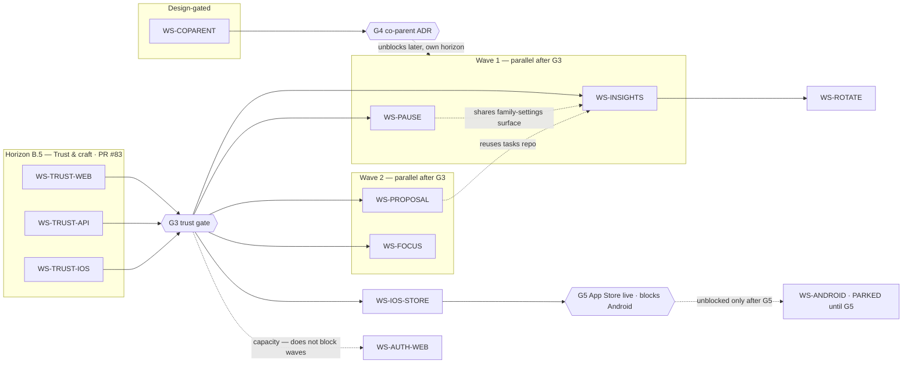

# Wispel — post-review workstreams (Horizon B.5 + feature streams)

**Status:** design locked — Horizon B.5 build open — companion to [`wispel-build-plan-workstreams.md`](./wispel-build-plan-workstreams.md)
**Audience:** eng + design + PO leads
**Origin:** product/security review 2026-07-31 (7 web bugs, 3 API security highs, 5 iOS safety/a11y items, 5 proposed features)
**Stance:** critical. Earn trust before adding surface. A wrong point balance or a leaked invite token costs more goodwill than any new feature buys.

**Locked (inherited, do not reopen without ADR):** privacy first · free for families · donations parent-only · product name **Wispel** · child vocab **Ster / Star** (never Held/Hero) · the six hard architecture rules in `CLAUDE.md`.

---

## 1. Critical verdict & sequencing philosophy

The five proposed features are all defensible product bets. Shipping any of them **before** the review's Critical/High defects is not.

| Reality from the review | Implication |
| --- | --- |
| Ledger sign/display bug (`+/-50`) on web | A visibly wrong point balance breaks the one number the whole app is about. **Blocker.** |
| Approval queue misses overnight `submitted` instances | Parents silently fail to approve → kids don't get points → churn. **Blocker.** |
| Double-click approve mints a *new* Idempotency-Key per click | Defeats hard rule 2 at the client edge; double-approve races the DO. **Blocker.** |
| `/auth/refresh` + `/child-session/refresh` have no rate limit | Token-guessing / brute-force surface on the two endpoints that mint sessions. **Security high.** |
| `POST /account/export` has no rate limit and no idempotency | Cheap way to spawn unbounded R2 ZIP jobs (AVG art. 20 abuse). **Security high.** |
| `inviteToken` returned in the co-parent invite response body | Token is emailed *and* echoed to the caller; web fell back to clipboard because of it. PII-adjacent secret in a response + logs risk. **Security high.** |
| PIN stored as plaintext in iOS Keychain | Child credential at rest in the clear. **Security high.** |
| Co-ouderschap = ADR-0004, still **Concept / not approved** | Cannot code; needs a product+security lock first. |

**Ship philosophy for this catalog: one trust horizon, then feature streams.**

1. **Horizon B.5 — Trust & craft** (fix the Critical/High defects across web, API, iOS). Nothing new ships on top of a wrong balance.
2. **Feature streams** — Insights → Pause → Teen proposal → Focus, gated behind B.5 and each other only where they truly depend.
3. **Co-parent** stays a **design/ADR stream**: it produces the approved ADR-0004 + migration plan, and does **not** merge schema until the gate opens.

Anything that puts a new feature PR ahead of the ledger fix or the invite-token fix is optimizing for a demo over a trustworthy Wispel.

---

## 2. Gates (non-negotiable)

Horizon A/B gates (G0 brand lock, G1 legal, G2 infra freeze) still apply from the base build plan. This catalog adds three.

### Gate G3 — Trust gate (blocks every feature stream in this catalog)

No workstream in §5 beyond `WS-TRUST-*` may **merge to `main`** until:

| Must be true | Evidence |
| --- | --- |
| Ledger balance renders with correct sign everywhere (web + iOS) | Regression test asserting `-50` redemption and `+50` earn both display and sum correctly |
| Approval queue shows all `submitted` / `completed` instances regardless of date | Test: instance submitted yesterday appears in today's parent queue |
| Approve/complete/redeem use a **stable** Idempotency-Key per user action | Test: two rapid submits with one key → one ledger write |
| `/auth/refresh`, `/auth/child-session/refresh`, `POST /account/export` are rate-limited | Authz/ratelimit test per endpoint |
| Invite token is no longer echoed in the invite response body by default | Contract test asserts response shape has no `inviteToken` when email delivery is on |
| iOS PIN is not stored in plaintext | Code review + unit test on the keychain wrapper |

### Gate G4 — Co-parent ADR lock (blocks `WS-COPARENT` coding only)

`WS-COPARENT` may produce docs, schema sketches, and an authz test matrix, but **no migration and no route** merge until ADR-0004 exit criteria are met:

- [ ] PO + architect + security sign off on Option A/B/C
- [ ] DPIA co-parent paragraph filled (`docs/taakhelden-dpia-starter.md`)
- [ ] Migration plan with rollback + backfill of existing `members`
- [ ] Authz test matrix (child never sees another family; parent A never sees family B)
- [ ] `docs/ios-phase3-plan.md` §9 updated with the final model

### Gate G5 — iOS App Store live (blocks any Android workstream)

`WS-ANDROID` and any Android-first or cross-platform scaffolding may **not start** until:

| Must be true | Evidence |
| --- | --- |
| Wispel iPhone app accepted by Apple and publicly available in the NL App Store | App Store listing URL live |
| Sign in with Apple (SIWA) + account-delete flow working on production App Store build | SIWA login + account-delete tested end-to-end |
| Privacy nutrition labels submitted and approved by App Store Connect | App Store Connect approval confirmed |
| ReviewNotes contain real staging credentials (parent + child accounts, not stub bypass) | Live staging credentials confirmed in App Store Connect |
| No P0 trust blockers open at submission | Zero Critical/High issues tagged P0 in the issue tracker |

**Rationale (PO lock 2026-08-01 — P8):** Android demand is real (medium demand signal in competitive research) but an unfinished iOS app costs more attention than Android can buy. Once iOS is live in the App Store with a stable API contract, Android becomes a concrete second platform — not a parallel bet that halves focus during the most critical ship window. Marketing may describe Wispel as iOS-first; do not promise an Android date.

### Gate reaffirmation — the six hard rules apply to every new endpoint

No SQL in routes (all in `repo/`, `familyId` first arg) · ledger writes only via FamilyRoom DO · balance = `SUM(points_ledger)` · no negative mechanics outside redemption/cancel · no child PII/logging, EXIF-strip before visible · Zod contract in `packages/shared` first. Every new mutation route carries `Idempotency-Key`; ledger routes **require** it.

---

## 3. Horizon map



`WS-INSIGHTS` also finally retires the `inzichten` `SectionStub` (open point O15 in the base plan), so it doubles as the missing piece of `WS-WEB-CRAFT`. `WS-IOS-STORE` runs in parallel with feature waves as the critical path to Gate G5 (iOS App Store live), which is the sole unblock condition for `WS-ANDROID`.

---

## 4. Workstream catalog

| ID | Name | Horizon | Owner archetype | Parallel? | Gate |
| --- | --- | --- | --- | --- | --- |
| **WS-TRUST-WEB** | Critical parent-web defects | B.5 | Web | ✅ in this PR | — |
| **WS-TRUST-API** | Security highs (rate limit, export, invite token) | B.5 | Backend + Security | ✅ in this PR | — |
| **WS-TRUST-IOS** | iOS safety + a11y + device hygiene | B.5 | iOS | ✅ in this PR (multi-child picker deferred) | — |
| **WS-INSIGHTS** | Inzichten Gesprekskaart (replace stub) | Feature | Web + Backend | After G3 | G3 |
| **WS-PAUSE** | Rustschild — per-child pause | Feature | Backend + Web + iOS | After G3 | G3 |
| **WS-PROPOSAL** | Taakvraag — teen task proposal | Feature | Backend + iOS + Web | After G3 | G3 |
| **WS-FOCUS** | Focusmodus — homework timer | Feature | iOS (+ thin Backend) | After G3 | G3 |
| **WS-COPARENT** | Co-ouderschap data model (ADR-0004) | Design-gated | Architect + Backend + iOS | Design only | G4 |
| **WS-AUTH-WEB** | Forgot-password + basic account recovery (web) | Feature | Web | After G3 or parallel with wave 1 | G3 |
| **WS-ROTATE** | Sibling task rotation UI (uses existing rotation JSON) | Feature | Web + iOS | After wave 1 | — |
| **WS-IOS-STORE** | App Store submission readiness (path to G5) | iOS-Ship | iOS | Parallel with feature waves | G3→G5 |
| **WS-ANDROID** | Android app — **PARKED, not before G5** | PARKED | — | Do not start | G5 |

**Owner archetype** = skill mix, not headcount. Streams marked "start now" have no cross-dependency and can run fully in parallel — they touch disjoint layers (web components / API middleware / Swift).

---

## 5. Workstream specs

Each spec: **goal · in/out of scope · API/schema sketch · UI surfaces · acceptance criteria · dependencies · docs to update · build order**.

Schema conventions to follow (from the codebase): Zod schemas live in `packages/shared/src/schemas/*.ts` and are re-exported from `index.ts`; repo functions take `familyId` as the first argument; ledger-affecting mutations go through `callFamilyRoom(c, "/…", payload)` and a new `case` in `FamilyRoom.handleMutation`; migrations are new numbered files starting at **0009** with a `.verify.sql` sibling.

---

### WS-TRUST-WEB — Critical parent-web defects (Horizon B.5)

**Goal:** the parent dashboard shows the *correct* number, never drops an approval, and never double-books. No new features — only correctness and resilience.

| In scope | Out of scope |
| --- | --- |
| Ledger `+/-50` sign/format bug on balance + history rows | Full Inzichten (that's WS-INSIGHTS) |
| Approval queue overnight gap (`/instances/today` only) | Redesigning the approval UI |
| Double-click approve → stable Idempotency-Key per action | New idempotency backend (DO already dedups) |
| Shop/redeem error swallowing → surfaced error copy | New shop features |
| Photo thumbnail no-retry → retry/backoff + fallback | Photo pipeline changes (API) |
| `RequireFullParent` treating upstream 5xx as 403 | Reworking auth model |
| Mobile sidebar (unusable on small screens) | Full responsive redesign |

**Design sketches (web-layer, no contract change needed for most):**

- **Ledger sign.** Root cause is display, not data: `points_ledger.amount` is already signed (negative only for `redemption`). Centralize formatting in one helper, e.g. `formatPoints(amount)` → `+50` / `−50` (true minus glyph), and render redemption rows from the *signed* amount, not `Math.abs`. Add a contract test that a redemption row and an earn row sum to the API `balance`.
- **Approval queue overnight gap.** The parent queue is being derived from `GET /instances/today`, which is date-scoped to the family-local `today`. A task submitted at 21:00 and not approved before midnight vanishes. **Fix without a new endpoint:** the parent "Goedkeuren" view must query the existing history endpoint filtered by status instead of `today`. Preferred: add a thin, read-only API affordance `GET /instances/pending-approval` (parent-only) returning all `submitted`/`completed` instances across dates, ordered oldest-first. This is a *repo* addition (`listPendingApproval(familyId)`), a `ParentApprovalQueue` Zod response in shared, and a route that calls only the repo — no ledger, no DO.
- **Stable Idempotency-Key.** The client mints a fresh UUID on every click, so a double-click sends two keys and the DO can't dedup. Derive the key **deterministically from the action + target + a per-mount nonce**: `idemKey = \`approve:${instanceId}:${actionNonce}\``, where `actionNonce` is fixed for the lifetime of one rendered row/button, not regenerated per click. Disable the button on first submit as belt-and-braces.
- **Shop error swallowing.** `redeem` failures (`INSUFFICIENT_POINTS`, `REWARD_LIMIT_REACHED`) are being caught and dropped. Map error codes → positive NL/EN copy and show them; never leave the child on a silent no-op.
- **Photo thumb retry.** Thumbnails whose signed URL 404s (still `processing`) get one silent failure. Add bounded retry with backoff and a neutral placeholder; poll `photoStatus` transitions `processing → ready`.
- **`RequireFullParent` 5xx.** The guard treats any non-200 from the API as "not a full parent" → renders forbidden. Distinguish: `403` → forbidden UI; `5xx`/network → retryable error state (`UPSTREAM_UNAVAILABLE` already exists as a code). Fail *closed* on 403, fail *soft* on 5xx.

**UI surfaces:** `/vandaag` (balance chips), `/goedkeuren` (queue), `/winkel` + child redeem, history/ledger rows, any parent-only settings guarded by `RequireFullParent`, global app shell (mobile sidebar).

**Acceptance criteria:**
1. A redemption of 50 renders as `−50` and history sums exactly to the API `balance` (contract test).
2. An instance submitted before midnight still appears in the parent approval queue the next morning (test against `listPendingApproval`).
3. Rapid double-click on Approve produces exactly one ledger entry and one `points.changed` broadcast (idempotency test through the DO).
4. A failed redeem shows positive, code-mapped copy; no silent failure.
5. A `processing` photo thumb retries and resolves to the image without a broken-image icon.
6. When the API returns 5xx, guarded pages show a retry state, not "geen toegang".
7. The sidebar is usable at 375px width (`/design-check` clean on touched pages).

**Dependencies:** none — start immediately. Coordinate the Idempotency-Key change with WS-TRUST-IOS (same client contract, different codebase).

**Docs to update:** `docs/taakhelden-api-specificatie.md` (add `GET /instances/pending-approval`), `docs/web-dashboard-roadmap.md` (queue source of truth).

**Build order within stream:** (1) ledger sign + test → (2) `pending-approval` repo+route+queue rewire → (3) stable idempotency key + button disable → (4) shop error surfacing → (5) 5xx-vs-403 guard → (6) photo retry → (7) mobile sidebar.

---

### WS-TRUST-API — Security highs (Horizon B.5)

**Goal:** close the three security-high findings without breaking existing clients.

| In scope | Out of scope |
| --- | --- |
| Rate-limit `/auth/refresh` + `/auth/child-session/refresh` | New auth providers |
| Rate-limit + idempotency on `POST /account/export` | Changing export ZIP contents |
| Stop echoing `inviteToken` in the invite response body | Rebuilding the invite flow |
| Regression/authz tests for all three | Migrating the KV rate-limiter to the Workers Rate Limiting API (track separately) |

**Design sketches:**

- **Refresh rate limits.** Both refresh routes currently skip `rateLimit()`. Add per-IP fixed-window limits consistent with the existing pattern in `routes/auth.ts`:
  ```ts
  auth.post("/refresh", validate("json", RefreshBody), async (c) => {
    await rateLimit(c, "refresh", 30);               // 30/min/IP
    // …existing consumeRefreshToken flow
  });
  auth.post("/child-session/refresh", validate("json", ChildSessionRefreshBody), async (c) => {
    await rateLimit(c, "child-refresh", 30);
    // …
  });
  ```
  Rationale: refresh is legitimately bursty (app foreground) so the ceiling is higher than login's `5`, but bounded to kill brute-force. Rotating refresh tokens are single-use already (`consumeRefreshToken`), so the limit protects the *guessing* surface, not correctness.
- **Export rate limit + idempotency.** `POST /account/export` spawns an async R2 ZIP job with no throttle. Add:
  - `await rateLimit(c, "export", 3, 3600)` — 3 exports/hour/IP (AVG art. 20 is not a high-frequency right).
  - Require `Idempotency-Key` via `requireIdempotencyKey` so a retried request returns the same `exportId` instead of enqueuing a second job. Because export is not a ledger route, dedup can ride the existing KV idempotency middleware; store the `{exportId,status}` response under the key.
  - Optionally short-circuit if an export job for the family is already `pending`/`processing` (repo `getActiveExportJob(familyId)`), returning that job — cheap abuse defense and better UX.
- **Invite token no longer in the response body.** Today `POST /families/.../invite` returns `{ …, inviteToken }` (routes/families.ts). The token is also emailed. Echoing it means the secret can land in web logs, proxies, and the BFF response cache.
  - **Design:** default response drops `inviteToken`. The parent-facing "kopieer uitnodiging" web feature (the clipboard fallback) instead copies a **link** built from a one-shot, short-TTL reveal, not the raw token in the create response.
  - Two acceptable shapes (pick in O-lock below):
    - **A (recommended):** create returns only `{ userId, email, permissions, status: "invited" }`. If email delivery is unavailable, the UI calls a separate parent-only `GET /families/me/invites/:userId/link` that mints a fresh tokenized URL on demand and is itself rate-limited + audit-safe. Token never appears in the create response or logs.
    - **B:** keep a single response but move the token into a `copyableLink` field that is a full `https://app.wispel.cc/uitnodiging#<token>` URL, mark the field `@sensitive`, and add a lint/log-scrub rule so it's never logged. Weaker; still puts the secret in one response.
  - Either way: add a Zod `InviteResponse` that **does not** include a bare `inviteToken`, and a contract test asserting the field is absent by default.

**API/schema sketch (shared):**
```ts
// packages/shared/src/schemas/family.ts (extend)
export const InviteResponse = z.object({
  userId: z.string(),
  email: z.string().email(),
  permissions: z.enum(["full", "approve_only"]),
  status: z.literal("invited"),
});
export const InviteLinkResponse = z.object({          // Option A only, parent-only, rate-limited
  copyableUrl: z.string().url(),
  expiresAt: z.string(),
});
```

**UI surfaces:** none child-facing. Parent web invite dialog (copy-link path); no iOS surface required.

**Acceptance criteria:**
1. `/auth/refresh` and `/auth/child-session/refresh` return `429 RATE_LIMITED` past the window (test each).
2. `POST /account/export` is throttled and idempotent: same `Idempotency-Key` → same `exportId`, one queue message (test).
3. The invite create response contains **no** `inviteToken` (contract test).
4. Copying an invite still works end-to-end via the link path (web test).
5. No new endpoint bypasses `repo/` or logs a token/PII (review + grep in tests).

**Dependencies:** the invite-token change is a contract change — coordinate with the web invite dialog (may overlap WS-TRUST-WEB owner). Rate-limit and export changes are independent.

**Docs to update:** `docs/taakhelden-api-specificatie.md` (invite response shape, export limits, refresh limits), `docs/taakhelden-privacy-minimum.md` (invite token handling), `docs/adr/ADR-0002-*` referenced for refresh model (no change, just cite).

**Build order within stream:** (1) refresh rate limits + tests → (2) export limit+idempotency+tests → (3) invite-token removal + `InviteResponse` + web link path → (4) log-scrub assertion test.

---

### WS-TRUST-IOS — iOS safety, a11y & device hygiene (Horizon B.5)

**Goal:** the child credential is safe at rest, the app respects accessibility, one device serves a real family, and logout leaves no live push channel.

| In scope | Out of scope |
| --- | --- |
| PIN: stop storing plaintext in Keychain | Server PIN model (already argon2 in D1) |
| Undo ("oeps") UI — API exists, UI missing | New undo semantics (5-min window is fixed) |
| `CelebrationService` respects `reduceMotion` | New celebration art |
| Multi-child per shared device (iPad) | Co-parent multi-family (that's WS-COPARENT) |
| Device deregister on logout | Full device-management screen |

**Design sketches:**

- **PIN at rest.** The child PIN authenticates to the *server* which stores `pincode_hash` (argon2). The device must **never** persist the raw PIN. Store only the **child device refresh token** (already the design in ADR-0002 / migration 0006) in Keychain with `kSecAttrAccessibleWhenUnlockedThisDeviceOnly`, and drop any plaintext PIN caching entirely. If a local "quick unlock" is wanted, store a device-salted hash, never the PIN. No API change.
- **Undo UI.** `POST /instances/:id/undo` and `applyUndo` (5-min window, blocks once `approved`) already exist. Add the child-facing "Oeps, toch niet" affordance on a just-completed instance, with the positive copy and the `UNDO_WINDOW_EXPIRED` error mapped to friendly text. Pure client work against the existing contract.
- **reduceMotion.** `CelebrationService` fires confetti unconditionally. Gate the motion behind `UIAccessibility.isReduceMotionEnabled` (and observe `reduceMotionStatusDidChangeNotification`): when on, swap confetti for a static/low-motion celebration but keep the *reward* (points, badge) intact. Accessibility, not feature loss.
- **Multi-child per device.** The data model already supports it: `devices` PK is `(apns_token, user_id)` ("gedeelde iPad: token ↔ meerdere profielen") and child-device sessions are per child (migration 0006). The gap is UI: a profile picker on the shared iPad that switches the active child session without re-onboarding. No schema change; a session-management + picker screen.
- **Device deregister on logout.** Logout revokes the refresh token (`/auth/logout`) but leaves the APNs token registered → the child keeps receiving pushes on a device they logged out of. On logout, call the existing device-delete path to remove the `(apns_token, user_id)` row for the departing profile only (not other profiles on a shared iPad). Confirm `DELETE /devices/:token` scopes to the acting `user_id`; if not, that's a tiny API fix (repo already `familyId`-scoped).

**UI surfaces:** child login/unlock, "Mijn Dag" instance card (undo), celebration overlay, shared-device profile picker, settings/logout.

**Acceptance criteria:**
1. No code path writes the raw PIN to Keychain or `UserDefaults`; only the device refresh token (or a device-salted hash) is stored (unit test on the keychain wrapper).
2. A child can undo a just-completed task within 5 min from the UI; after 5 min the friendly `UNDO_WINDOW_EXPIRED` copy shows.
3. With Reduce Motion on, celebrations use no confetti animation but still award and announce points/badges (a11y test).
4. Two children on one iPad can each log in, switch, and complete their own tasks without re-onboarding; neither sees the other's queue.
5. After logout, the device stops receiving that child's pushes; other profiles on the same device are unaffected.

**Dependencies:** must adopt the **same stable Idempotency-Key convention** decided in WS-TRUST-WEB (shared client contract). Otherwise independent.

**Docs to update:** `docs/taakhelden-ios-bouwvoorstel.md` (Keychain policy, undo UI, reduceMotion, shared-device), `docs/adr/ADR-0002-child-device-refresh-and-under13-unlock.md` (cite; note plaintext-PIN prohibition), `docs/ios-phase3-plan.md` (device hygiene checklist).

**Build order within stream:** (1) Keychain PIN fix (security first) → (2) device deregister on logout → (3) undo UI → (4) reduceMotion → (5) shared-device picker.

---

### WS-INSIGHTS — Inzichten Gesprekskaart (Feature, gated behind G3)

**Goal:** replace the `inzichten` `SectionStub` with a **read-only "gesprekskaart"** (conversation card) that helps a parent talk with their child — trends per week, which tasks keep slipping, earned vs spent. Framed as *help for the conversation, never surveillance* (productvoorstel §3.6). This closes open point **O15**.

| In scope | Out of scope |
| --- | --- |
| Read-only weekly aggregates derived from `points_ledger` + `task_instances` | Any write, any new tracking of the child |
| Per-child + family view; earned vs spent; tasks-left; streak context | Ranking children against each other (hard rule: no sibling ranking) |
| Positive, non-judgmental framing + copy | Predictive/behavioral scoring, ML |
| One API endpoint + one shared schema + one page | Data export beyond existing AVG export |

**API/schema sketch:**
- **Endpoint:** `GET /families/me/insights?range=week&weekOf=YYYY-MM-DD&childId=<optional>` — **parent-only** (`requireParent`). Read-only; no DO, no ledger write. Pure `repo/` aggregation with `familyId` first arg.
- **Repo:** `repo/insights.ts` → `weeklyInsights(db, familyId, { weekOf, childId? })` running `SUM(amount) FILTER`-style aggregates over `points_ledger` (earned = positive non-`redemption_cancel`, spent = `redemption` magnitude) and `task_instances` counts by status (open / submitted / approved) grouped by `task_id` to find "tasks that keep slipping".
- **Shared schema (`packages/shared/src/schemas/insights.ts`, re-export from index):**
```ts
export const InsightsRange = z.enum(["week"]);

export const ChildInsights = z.object({
  childId: z.string(),
  displayName: z.string(),
  earned: z.number().int().nonnegative(),
  spent: z.number().int().nonnegative(),          // magnitude of redemptions in range
  net: z.number().int(),                          // earned - spent (can be 0+, never framed as debt)
  tasksApproved: z.number().int().nonnegative(),
  tasksTotal: z.number().int().nonnegative(),
  completionRate: z.number().min(0).max(1),
  streakDays: z.number().int().nonnegative(),
  slippingTasks: z.array(z.object({               // tasks most often left open/redo this range
    taskId: z.string(),
    title: z.string(),
    icon: z.string(),
    missed: z.number().int().positive(),
  })).max(5),
});

export const WeeklyInsightsResponse = z.object({
  weekOf: z.string(),                             // Monday ISO date, family tz
  range: InsightsRange,
  children: z.array(ChildInsights),
});
export type WeeklyInsightsResponse = z.infer<typeof WeeklyInsightsResponse>;
```
- **No migration required** — everything is derivable from existing tables. (Add covering indexes only if profiling shows the weekly scan is slow; `idx_ledger_child` and `idx_instances_child_date` already exist.)

**UI surfaces:** `/inzichten` (replace `SectionStub`), parent register only (calm/neutral). Copy tone: "Waar ging het goed, waar kan hulp helpen?" — never "je kind faalde". Add to parent nav (removes the stub). Never rendered on any child tab.

**Acceptance criteria:**
1. `/inzichten` shows real earned/spent/completion per child for the selected week; the stub is gone (O15 closed).
2. Numbers reconcile with the ledger: `earned - spent == net`, and `net` summed over history == current balance for that child (contract test).
3. No sibling ranking or leaderboard; children shown side-by-side without ordering by performance.
4. Endpoint is parent-only (`403` for child tokens) and read-only (authz test).
5. No child PII beyond `displayName` leaves the API; nothing logged with names (privacy review).
6. Copy passes `@dutch-child-copy` / positive-tone review; `/design-check` clean.

**Dependencies:** G3. Shares the `RequireFullParent` fix from WS-TRUST-WEB (so a 5xx doesn't render as forbidden on this page). Overlaps WS-WEB-CRAFT's "hide or ship Inzichten" — this **ships** it.

**Docs to update:** `docs/taakhelden-api-specificatie.md` (new endpoint), `docs/taakhelden-productvoorstel.md` §3.6 (mark insights shipped), base build plan §13.7 (mark O15 resolved), `docs/web-dashboard-roadmap.md`.

**Build order within stream:** (1) shared schema → (2) `repo/insights.ts` + reconciliation test → (3) route + authz test → (4) `/inzichten` page + design pass.

---

### WS-PAUSE — Rustschild (per-child pause) (Feature, gated behind G3)

**Goal:** let a parent pause a **single child** (illness, holiday with one kid, hard week) so tasks don't pile up and the streak isn't punished — a "rustschild" (rest shield). Family-level `vacation_mode` already exists (migration 0001); this adds per-child granularity. Strictly non-punitive (hard rule 4: no negative mechanics).

| In scope | Out of scope |
| --- | --- |
| Per-child pause with optional date range; pauses streak, skips instance generation | Deleting or penalizing existing points |
| Parent set/clear; child sees a gentle "rustschild aan" state | Auto-pause heuristics |
| `computeStreak` / instance generation aware of pause | Family-wide vacation redesign |

**API/schema sketch:**
- **Migration 0009** (`0009_child_pause.sql` + `.verify.sql`):
```sql
CREATE TABLE child_pauses (
  id          TEXT PRIMARY KEY,
  family_id   TEXT NOT NULL REFERENCES families(id),
  child_id    TEXT NOT NULL REFERENCES users(id),
  starts_on   TEXT NOT NULL,                 -- YYYY-MM-DD family tz
  ends_on     TEXT,                          -- NULL = open-ended until cleared
  reason      TEXT,                          -- optional, parent-only note (never child PII beyond free text)
  created_by  TEXT NOT NULL REFERENCES users(id),
  created_at  TEXT NOT NULL DEFAULT (strftime('%Y-%m-%dT%H:%M:%fZ','now')),
  cleared_at  TEXT
);
CREATE INDEX idx_child_pauses_family_child ON child_pauses(family_id, child_id);
```
- **Repo:** `repo/pauses.ts` → `activePauseFor(db, familyId, childId, onDate)`, `listPauses(db, familyId, childId?)`, `setPause(db, familyId, {...})`, `clearPause(db, familyId, pauseId)`.
- **Endpoints (parent `full` for write, self-or-parent for read):**
  - `GET /members/:childId/pause` → current + upcoming pause.
  - `PUT /members/:childId/pause` (parent full) → `{ startsOn, endsOn?, reason? }`, `Idempotency-Key` optional (non-ledger).
  - `DELETE /members/:childId/pause/:id` (parent full) → clear.
- **Shared schema (`schemas/pause.ts`):**
```ts
export const ChildPause = z.object({
  id: z.string(),
  childId: z.string(),
  startsOn: z.string(),                 // YYYY-MM-DD
  endsOn: z.string().nullable(),
  reason: z.string().max(140).nullable(),
  active: z.boolean(),
});
export const SetChildPauseBody = z.object({
  startsOn: z.string(),
  endsOn: z.string().nullable().optional(),
  reason: z.string().max(140).optional(),
});
```
- **Engine integration (no ledger writes):**
  - `taskEngine.generateInstancesForFamily` skips instance creation for a child whose pause covers that date (no new open tasks pile up).
  - `computeStreak` treats paused days like the existing "forgiven" gap but **without** consuming the one-gap-per-week budget — a paused day is neither earned nor a miss. Add a `pausedDates` set parameter so streak logic stays pure/testable.
  - No point deduction, ever (hard rule 4). Existing balance untouched.

**UI surfaces:** parent web member settings ("Rustschild voor <naam>"), parent iOS member management, and a gentle child-facing "Je hebt even rust — geen taken vandaag" state on Mijn Dag (positive, no guilt). Never a donation or negative surface.

**Acceptance criteria:**
1. Setting a pause for one child stops new instance generation for that child in the range; siblings unaffected (engine test).
2. Paused days neither break the streak nor cost the weekly forgiveness budget; unpausing resumes cleanly (`computeStreak` unit test with `pausedDates`).
3. No ledger entry is created or removed by pausing/unpausing (test asserts ledger unchanged).
4. Only a `full` parent can set/clear; child can read own pause state (authz test).
5. Child sees a positive rest state; no guilt language (`@dutch-child-copy`).

**Dependencies:** G3. Touches `taskEngine` and `computeStreak` (shared with WS-FOCUS? no) — coordinate with WS-PROPOSAL only if both edit `taskEngine` (they can, different functions).

**Docs to update:** `docs/taakhelden-api-specificatie.md`, `docs/taakhelden-productvoorstel.md` §3.6 (vacation/pause), `CLAUDE.md` note that pause is non-punitive.

**Build order within stream:** (1) migration + repo → (2) streak/engine integration + unit tests → (3) shared schema + endpoints + authz test → (4) web parent UI → (5) iOS parent + child rest state.

---

### WS-PROPOSAL — Taakvraag (teen task proposal) (Feature, gated behind G3)

**Goal:** a teen can **propose** a task ("Taakvraag") they'd like added (with a suggested point value); a parent approves it into a real task or declines with friendly copy. Gives teens agency without breaking the rule that only parents create tasks/points.

| In scope | Out of scope |
| --- | --- |
| Teen creates a proposal; parent approve→task / decline | Teen creating tasks directly |
| Proposal list for parent; status for teen | Auto-approval or points on proposal alone |
| Approve reuses existing `createTask` | Negotiation threads / chat |

**API/schema sketch:**
- **Migration 0010** (`0010_task_proposals.sql`):
```sql
CREATE TABLE task_proposals (
  id             TEXT PRIMARY KEY,
  family_id      TEXT NOT NULL REFERENCES families(id),
  child_id       TEXT NOT NULL REFERENCES users(id),   -- proposer (teen)
  title          TEXT NOT NULL,
  category       TEXT NOT NULL DEFAULT 'household'
                 CHECK (category IN ('household','homework','selfcare','custom')),
  icon           TEXT NOT NULL DEFAULT 'star',
  suggested_points INTEGER NOT NULL CHECK (suggested_points > 0),
  note           TEXT,
  status         TEXT NOT NULL DEFAULT 'pending'
                 CHECK (status IN ('pending','approved','declined')),
  decided_by     TEXT REFERENCES users(id),
  decided_at     TEXT,
  created_task_id TEXT REFERENCES tasks(id),
  created_at     TEXT NOT NULL DEFAULT (strftime('%Y-%m-%dT%H:%M:%fZ','now'))
);
CREATE INDEX idx_proposals_family_status ON task_proposals(family_id, status);
```
- **Repo:** `repo/proposals.ts` → `createProposal(db, familyId, {...})`, `listProposals(db, familyId, {status?, childId?})`, `getProposal(db, familyId, id)`, `decideProposal(db, familyId, id, {...})`.
- **Endpoints:**
  - `POST /tasks/proposals` — child/teen only; `Idempotency-Key`. Body validated by `CreateProposalBody`. **No points**, no ledger.
  - `GET /tasks/proposals?status=pending` — parent sees all; child sees own.
  - `POST /tasks/proposals/:id/approve` — parent `full`; `Idempotency-Key`. Creates a real task via existing `createTask` (parent decides final points, may differ from `suggested_points`), sets `status='approved'`, `created_task_id`. Points only ever flow through the normal task→complete→approve path afterward.
  - `POST /tasks/proposals/:id/decline` — parent `full`; friendly `note`.
- **No FamilyRoom/ledger involvement** — proposals never touch points. Approve *creates a task* (a normal parent mutation), which then earns points through the existing engine like any other task. Broadcast a lightweight `proposal.updated` via the DO is optional (nice for realtime parent queue) but not required for correctness.
- **Shared schema (`schemas/proposal.ts`):**
```ts
export const ProposalStatus = z.enum(["pending", "approved", "declined"]);
export const CreateProposalBody = z.object({
  title: z.string().min(1).max(80),
  category: z.enum(["household","homework","selfcare","custom"]).default("household"),
  icon: z.string().min(1).max(24).default("star"),
  suggestedPoints: z.number().int().min(1).max(100),
  note: z.string().max(200).optional(),
});
export const ApproveProposalBody = z.object({          // parent may adjust before creating the task
  points: z.number().int().min(1).max(100),
  approvalRequired: z.boolean().default(false),
  assignees: z.array(z.string()).default([]),
});
export const DeclineProposalBody = z.object({ note: z.string().max(200) });
export const TaskProposal = z.object({
  id: z.string(), childId: z.string(), title: z.string(),
  category: z.string(), icon: z.string(),
  suggestedPoints: z.number().int(), note: z.string().nullable(),
  status: ProposalStatus, createdTaskId: z.string().nullable(),
});
```

**UI surfaces:** teen iOS ("Vraag een taak aan" on Mijn Dag/teen mode — teen register), parent web + iOS ("Taakvragen" queue near Goedkeuren), decline copy positive. Not shown to young/mid unless product wants it (default: teen only).

**Acceptance criteria:**
1. A teen can submit a proposal; it appears in the parent's proposal queue and in the teen's "aangevraagd" list (test).
2. A proposal alone creates **no** task and **no** ledger entry (test).
3. Parent approve creates a real task (points as parent set, not necessarily the suggestion) and links `created_task_id`; declining sets `declined` with a note (test).
4. Child sees only own proposals; parent-only decide endpoints reject child tokens (authz test).
5. Approve/decline are idempotent (double-tap → one decision, one task).
6. Decline copy is friendly/non-dismissive (`@dutch-child-copy`).

**Dependencies:** G3. Reuses `repo/tasks.createTask`. Coordinate with WS-PAUSE only if both edit `taskEngine` (they touch different files, low risk).

**Docs to update:** `docs/taakhelden-api-specificatie.md`, `docs/taakhelden-ios-bouwvoorstel.md` (teen mode), `docs/taakhelden-productvoorstel.md` (teen agency).

**Build order within stream:** (1) migration + repo → (2) shared schemas → (3) create + list endpoints + authz test → (4) approve/decline (reuse createTask) + idempotency test → (5) parent queue UI → (6) teen submit UI.

---

### WS-FOCUS — Focusmodus (homework timer) (Feature, gated behind G3)

**Goal:** a lightweight homework/focus timer for a child (Pomodoro-style) that encourages sitting down to homework. **Privacy-first and non-gameable:** the timer does **not** mint points (that would incentivize idling), and detailed session data is **not** required server-side.

| In scope | Out of scope |
| --- | --- |
| Client-side timer (start/pause/stop), gentle end celebration (reduceMotion-aware) | Points for time spent (gameable → hard rule against negative/derived abuse) |
| Optional, minimal, **aggregate** server record (count only) if product wants a "je hebt X keer gefocust" badge | Per-minute logging or screen-time surveillance |
| Link a focus session to an existing homework task's completion (optional) | Background/OS screen-time integration |

**Design stance (architect recommendation):** ship **client-only first**. A focus timer is a device UX feature; it needs no server state to be useful and adding per-session server logging is a privacy liability with little product upside. If a "focus badge" is desired later, record only an **aggregate count**, never durations or timestamps that profile the child.

**API/schema sketch (only if the optional badge path is chosen — otherwise no API):**
- **Migration 0011 (optional, deferred):** add `focus_sessions_count INTEGER NOT NULL DEFAULT 0` to `users` (a single counter), **not** a per-session table. Increment via a normal idempotent mutation; wire a badge in the existing badge engine (`qualifyingBadgeIds`) keyed on the count. Badges are non-point (or a tiny fixed `badge` ledger entry, which is already an allowed positive type) — decide in O-lock.
- **Endpoint (optional):** `POST /focus/session-complete` — child only; `Idempotency-Key`; increments the counter, returns any newly earned focus badge. Goes through FamilyRoom only if it awards a `badge`-type ledger entry (to keep ledger writes serialized); otherwise a plain repo increment.
- **Shared schema (optional, `schemas/focus.ts`):**
```ts
export const FocusSessionCompleteBody = z.object({
  taskId: z.string().optional(),      // optional link to a homework instance
  durationMinutes: z.number().int().min(1).max(120),  // client-reported, used only for UX copy, not stored raw
});
export const FocusSessionResult = z.object({
  focusCount: z.number().int().nonnegative(),
  newBadges: z.array(z.object({ id: z.string(), title: z.string(), icon: z.string() })),
});
```
Note: even if `durationMinutes` is sent, the server stores only the **incremented count**, never the raw duration — dataminimalisatie.

**UI surfaces:** child iOS (timer on a homework task / Mijn Dag), reduceMotion-aware completion, positive copy. No parent surface required for v1; no child-facing donation/tracking. No web surface.

**Acceptance criteria:**
1. Timer runs entirely on-device; with no network it still works (offline test).
2. No points are awarded merely for elapsed time (test / design review).
3. If the optional badge path ships: only an aggregate count is persisted — no per-session durations/timestamps in D1 (schema review + test).
4. Completion celebration respects Reduce Motion (shares WS-TRUST-IOS fix).
5. No new child tracker, SDK, or analytics event (privacy review).

**Dependencies:** G3, and the reduceMotion work in WS-TRUST-IOS (reuse). Smallest stream; can be built by the iOS owner after TRUST-IOS lands.

**Docs to update:** `docs/taakhelden-ios-bouwvoorstel.md` (focus timer), `docs/taakhelden-privacy-minimum.md` (no duration logging), productvoorstel §Fase 3 (focustimer).

**Build order within stream:** (1) client timer + offline → (2) reduceMotion completion → (3) *optional* aggregate counter + focus badge (only if product locks O-FOCUS).

---

### WS-COPARENT — Co-ouderschap data model (Design-gated behind G4)

**Goal:** turn ADR-0004 (Concept, **not approved**) into an approved decision + implementable migration/authz plan. This stream **produces design artifacts**; it does not merge schema or routes until G4 opens.

| In scope (now) | Out of scope (until G4) |
| --- | --- |
| Drive ADR-0004 to `accepted` with Option A/B/C chosen | Any migration merge |
| Migration + backfill plan with rollback | Any route or JWT change |
| Authz test matrix (child never sees another family; parent A never sees family B) | iOS profile-switch UI |
| DPIA co-parent paragraph | Shared point pot across unrelated families (explicit non-goal) |

**Recommended direction (architect):** **Option A — one child identity, multiple family memberships** (ADR-0004 §Optie A). It gives a single point history the child carries "bij mama / bij papa", which matches the product promise better than double profiles (Option B, sync hell) or read-only guest (Option C, too thin for NL co-parenting).

**Design sketch (for the ADR, not to merge yet):**
- New `child_identities(id, display_name, birth_year, …)` and `family_memberships(child_identity_id, family_id, role, pin_hash?, …)`; migrate existing `users` where `role='child'` into an identity + one membership (backfill).
- **Ledger decision (must be explicit in the ADR):** either (a) ledger stays **per (family_id, child_id)** so points don't leak across households — recommended, matches hard rule 3 and the `familyId` security boundary — or (b) a single ledger per identity with `family_id` context. Recommendation: **per family**; a child's balance is a family-local concept, and a shared pot across two households violates the `familyId` boundary and is an ADR-0004 non-goal.
- **Auth:** child session must carry both `child_identity_id` and an **active** `family_id`; every repo call stays `familyId`-first (unchanged security grain). Switching context = new active `family_id`, re-scoped queries.
- **Authz test matrix (blocking artifact):** child in family A never reads family B; parent A never reads B; a shared identity's balance in A is invisible in B.

**Acceptance criteria (this stream = the ADR is done, not the feature):**
1. ADR-0004 status flips to `accepted` with a chosen option and a ledger-scoping decision recorded.
2. A migration + rollback + backfill plan exists and is reviewed (not merged).
3. DPIA co-parent paragraph is filled.
4. Authz test matrix is written (as failing/pending tests or a spec) proving cross-family isolation.
5. `docs/ios-phase3-plan.md` §9 updated with the final model.

**Dependencies:** G4. Independent of all feature streams; can proceed as pure design in parallel with B.5.

**Docs to update:** `docs/adr/ADR-0004-coparenting-data-model.md` (decision), `docs/taakhelden-dpia-starter.md`, `docs/ios-phase3-plan.md` §9, base build plan §13.6 O34 (co-parent now scoped).

---

### WS-AUTH-WEB — Forgot-password + basic account recovery (web) (Feature, after G3 or parallel with wave 1)

**Goal:** remove a table-stakes friction point for parents who forget their password — email-based reset flow on the web dashboard. Every competitor in the competitive research scorecard has some form of account recovery; Wispel's absence is noted as open point O16 in the base plan.

| In scope | Out of scope |
| --- | --- |
| Forgot-password link on login, email → time-limited token → reset form | Social login / OAuth (Google, Apple — separate ADR) |
| Reset token stored hashed + expiry in D1; one active token per account | Child account recovery (no child email — hard rule 5, by design) |
| Rate-limited `POST /auth/forgot-password` + `POST /auth/reset-password` | Account merge or cross-device recovery |
| Web UI with success/error states in NL | New transactional email template design |

**API/schema sketch:**
- **Migration 0012** — add `password_reset_tokens` table:
  ```sql
  CREATE TABLE password_reset_tokens (
    token_hash TEXT PRIMARY KEY,
    user_id    TEXT NOT NULL REFERENCES users(id),
    expires_at TEXT NOT NULL,
    used_at    TEXT
  );
  CREATE INDEX idx_prt_user ON password_reset_tokens(user_id);
  ```
- **Endpoints (no auth required):**
  - `POST /auth/forgot-password` → `{ email }` — rate-limited (5/hour/IP); always returns `200` (no email enumeration); enqueues reset email only if parent account exists.
  - `POST /auth/reset-password` → `{ token, newPassword }` — validates token hash, expiry, not-used; updates password hash; marks token `used_at`.
- **Shared schema (`schemas/auth.ts` extension):**
  ```ts
  export const ForgotPasswordBody = z.object({ email: z.string().email() });
  export const ResetPasswordBody = z.object({
    token: z.string().min(32),
    newPassword: z.string().min(8).max(128),
  });
  ```

**UI surfaces:** Login page (forgot-password link), web reset-password route. No child-facing surface (no child email by design).

**Acceptance criteria:**
1. Parent can request a reset email and use the link to set a new password; old password no longer works (test).
2. `POST /auth/forgot-password` returns `200` regardless of whether the email exists — no enumeration (test both cases).
3. Reset token stored hashed; raw token is never logged (code review + test).
4. Expired or used tokens are rejected with a clear NL error state.
5. Endpoint is rate-limited; child accounts are ineligible (no child email — authz test).
6. No code path writes the raw reset token to logs or response body (grep + test).

**Dependencies:** G3 (or can start in parallel with wave 1 if capacity permits — it touches auth routes only and does not overlap wave 1 files). Coordinates with WS-TRUST-API rate-limit patterns.

**Docs to update:** `docs/taakhelden-api-specificatie.md` (new endpoints), O16 in `docs/wispel-build-plan-workstreams.md` (mark resolved).

**Build order within stream:** (1) migration + repo + token hashing → (2) endpoints + rate limit + authz test → (3) email send integration → (4) web forgot-password UI + reset form.

---

### WS-ROTATE — Sibling task rotation UI (Feature, after wave 1)

**Goal:** surface the existing task rotation JSON model in a parent-facing UI so families can configure rotating chore assignments (e.g. "afwassen" alternates weekly between Lotte and Finn). The rotation data model already exists in `tasks.rotation_config`; this stream adds the UI to configure and visualise it.

| In scope | Out of scope |
| --- | --- |
| Parent web UI to configure rotation pattern for a task (add/remove assignees, set frequency) | Inventing a new rotation engine (model exists) |
| Display which child is "up next" in task detail and Mijn Dag | Complex fair-split algorithms |
| Visualise current rotation cycle on parent task detail | Per-child task analytics (that's WS-INSIGHTS) |

**API/schema sketch:** No new migration; rotation config lives in `tasks.rotation_config` (existing column). Extend `PATCH /tasks/:id` to accept a `rotationConfig` field (or add a dedicated `PUT /tasks/:id/rotation`). Ensure `RotationConfig` is defined and exported in `packages/shared`.

**UI surfaces:** Parent web task-create/edit form (rotation tab), task detail "wie is nu aan de beurt", parent iOS task-edit screen. Child-facing Mijn Dag shows whose turn it is with positive copy.

**Acceptance criteria:**
1. Parent can configure a rotation schedule for a task (add members, set weekly/alternating); next assignee updates on the next generation cycle (engine test).
2. Parent sees "nu aan de beurt: Lotte" on the task detail and it advances after each cycle (test).
3. Rotation config persists across restarts; disabling rotation reverts to fixed assignee (test).
4. Child sees who's up next in positive copy; no "you lost your turn" framing (`@dutch-child-copy`).
5. No ledger entry is created or modified by changing rotation (test).

**Dependencies:** G3; wave 1 (WS-INSIGHTS + WS-PAUSE) should land first so rotation can reuse any shared task-detail component patterns. Does not touch the ledger.

**Docs to update:** `docs/taakhelden-api-specificatie.md` (rotation config extension), `docs/taakhelden-productvoorstel.md` (rotation feature).

**Build order within stream:** (1) Confirm `RotationConfig` schema in shared → (2) extend `PATCH /tasks/:id` + repo → (3) parent web rotation UI → (4) iOS parent edit → (5) child Mijn Dag "wie is aan de beurt" display.

---

### WS-IOS-STORE — App Store submission readiness (path to Gate G5)

**Goal:** get the Wispel iPhone app through App Store review and publicly available in the NL App Store. This is the **critical path to G5** and the sole prerequisite for any Android work.

| In scope | Out of scope |
| --- | --- |
| App Store Connect: metadata, screenshots, privacy nutrition labels, age rating (4+) | Android Google Play submission |
| ReviewNotes: real staging credentials (parent + child accounts) that work for Apple reviewer | New iOS features (not part of store submission) |
| Multi-child picker on shared iPad — residual from WS-TRUST-IOS (required before review) | Marketing copy on wispel.cc (that's WS-WEB-MKT) |
| SIWA + account-delete flow verified on production build | Full WS-IOS-AGE teen/young pass (can follow G5) |
| Final App Store PNG icon set (residual from WS-BRAND) | |
| TestFlight external test group → submission | |

**Acceptance criteria (maps directly to G5 criteria):**
1. App Store listing is live in NL region; Wispel iPhone app is publicly downloadable.
2. Sign in with Apple (SIWA) works on the production App Store build; account-delete flow passes Apple's required functionality check.
3. Privacy nutrition labels submitted match the codebase's actual data practices: no child email, EU hosting, no third-party tracking, EXIF-stripped photos.
4. ReviewNotes contain real staging parent + child credentials that allow an Apple reviewer to fully exercise the task-creation → approval → point-award loop.
5. Multi-child picker on shared iPad is functional and accessible (a11y bar met per WS-TRUST-IOS standards).
6. No P0 trust blockers are open at time of submission (G3 must be satisfied).

**Dependencies:** G3 must pass before submitting — a wrong balance or a leaked token in a review build is a rejection risk. WS-TRUST-IOS residual (multi-child picker). WS-BRAND residual (App Store PNG icons). Runs in **parallel** with feature waves; do not let feature-wave PRs block Store submission PRs from merging.

**Docs to update:** `docs/taakhelden-ios-bouwvoorstel.md` (App Store submission checklist + G5 criteria), `docs/wispel-post-review-workstreams.md` §2 Gate G5 checkboxes when completed.

**Build order within stream:** (1) Multi-child picker (TRUST-IOS residual) → (2) Final App Store PNG icon set → (3) Privacy nutrition label audit → (4) App Store Connect metadata + screenshots → (5) ReviewNotes real credentials → (6) TestFlight external test → (7) Submit → (8) Respond to any review feedback → **G5 ✅**.

---

### WS-ANDROID — Android app (PARKED until G5)

**Status: PARKED — do not start.**

Not started. Unblocked **only** when Gate G5 passes (Wispel iPhone app accepted by Apple and publicly available on the App Store).

No `WS-ANDROID` coding, no Android project scaffolding, no "Android soon" eng spikes that dilute iOS ship velocity. Marketing may describe Wispel as iOS-first; do not promise an Android date.

**PO lock 2026-08-01 — P8.** See §7 (P8) and Gate G5 in §2. Android demand is real (medium demand signal from competitive research) but halving focus before iOS ships is the wrong trade.

---

## 6. Build-first sequence (competitive-informed execution order)

This is the canonical post-competitive-research execution order as of **2026-08-01**, informed by findings in `docs/market-research/competitor-scorecard-2026-08.md`. It supersedes the earlier "what can start coding immediately" table.

| Step | What | Competitive / product rationale | Gate |
| --- | --- | --- | --- |
| **1** | **Finish + merge Horizon B.5 TRUST (PR #83)** — WS-TRUST-WEB + WS-TRUST-API + WS-TRUST-IOS (all parallel) | Nothing ships on top of a wrong balance or a leaked invite token. Earn trust before features. | → G3 |
| **2a** | **WS-INSIGHTS** (parallel with 2b) | Gesprekskaart — no competitor has it; closes O15; reuses `RequireFullParent` fix. **Wave 1 start.** | After G3 |
| **2b** | **WS-PAUSE** (parallel with 2a) | Rustschild — non-punitive per-child pause; differentiator vs S'moresUp's punitive chore-locking. **Wave 1.** | After G3 |
| **3a** | **WS-PROPOSAL** (parallel with 3b) | Taakvraag — teen task proposal; beats Gimi's absent propose-chore; reuses `createTask`. **Wave 2.** | After G3 |
| **3b** | **WS-FOCUS** (parallel with 3a) | Focusmodus — homework timer; **unique** differentiator: no competitor in the field has a homework category. **Wave 2.** | After G3 |
| **4** | **WS-IOS-STORE + WS-IOS-AGE leftovers** (ongoing, parallel with waves) | Critical path to G5 (App Store live). Multi-child picker, nutrition labels, ReviewNotes real credentials, screenshots. Do not let feature-wave PRs block this track. | → G5 |
| **5** | **WS-AUTH-WEB** when capacity — does not block waves | Forgot-password is table stakes; all 5 researched competitors have account recovery (O16). Can run parallel with wave 1 if capacity allows. | After G3 |
| **6** | **WS-ROTATE** after wave 1 | Sibling rotation UI using existing data model. Wave 1 must land first to avoid shared-component conflicts. | After wave 1 |
| **7** | **WS-COPARENT** design anytime; code only after G4 | ADR-0004 design track produces artifacts now; no migration merges until G4. | Design now; code after G4 |
| **8** | **WS-ANDROID** — **NOT before G5** | PARKED. Android demand is real but halving focus before iOS ships is the wrong trade. **PO lock P8, 2026-08-01.** | After G5 only |

**Coordination locks:**
- One owner for the **Idempotency-Key convention** (WS-TRUST-WEB) — WS-TRUST-IOS adopts the same string format.
- One owner for the **invite response contract** change (WS-TRUST-API ↔ web invite dialog).
- `taskEngine` edits (WS-PAUSE, WS-PROPOSAL) touch different functions — rebase, don't co-edit.
- `WS-IOS-STORE` runs alongside feature waves; feature-wave PRs must not block Store submission PRs from merging.
- `WS-AUTH-WEB` and wave 1 touch disjoint files — safe to run parallel if capacity permits.

**Migration numbering to reserve (append-only):** `0009_child_pause`, `0010_task_proposals`, `0011_focus_count` (optional), `0012_password_reset_tokens` (WS-AUTH-WEB). Co-parent migration number is assigned only when G4 opens.

---

## 7. Open decisions — ✅ ALL LOCKED 2026-08-01

| ID | Decision | Locked option | Rationale | Blocks |
| --- | --- | --- | --- | --- |
| P1 | ✅ LOCKED | **Option A** — separate `GET /families/me/invites/:userId/link` reveal endpoint; `inviteToken` is never echoed in the create response | A bare secret in a response body reaches logs, proxies, and BFF caches; a rate-limited reveal endpoint is safer and auditable | WS-TRUST-API |
| P2 | ✅ LOCKED | **Both `open` + `open_redo` count as "slipping"**, top 5 per child, no ranking between children | Counting only one status misses the redo-loop signal; ranking children violates the no-sibling-ranking hard rule | WS-INSIGHTS |
| P3 | ✅ LOCKED | **Open-ended pause is allowed** with an easy parent-facing "Rustschild uitzetten" clear action | Illness and extended holidays have no fixed end date; forcing one adds friction and introduces guilt pressure on the parent | WS-PAUSE |
| P4 | ✅ LOCKED | **Teen only** for Taakvraag v1 | Task negotiation is developmentally appropriate for teens; extending to mid-children in v1 adds scope and copy complexity without evidence of demand | WS-PROPOSAL |
| P5 | ✅ LOCKED | **Client-only timer for v1**; aggregate focus-badge is explicitly deferred | A client-side timer needs no server state; per-session logging is a privacy liability (dataminimalisatie); badge can be scoped once usage data warrants it | WS-FOCUS |
| P6 | ✅ LOCKED | **ADR-0004 Option A** (one child identity, multiple family memberships) + **per-family ledger** (balance is always scoped to one `family_id`) | Option A matches the product promise of a single point history; per-family ledger preserves the `familyId` security boundary and matches hard rule 3 — still behind G4 | WS-COPARENT / G4 |
| P7 | ✅ LOCKED | **Yes — send a positive push notification** to the teen when a parent approves their Taakvraag | Immediate positive feedback completes the agency loop and is consistent with the positive-only push stance; copy must pass `@dutch-child-copy` | WS-PROPOSAL |

| P8 | ✅ LOCKED | **Android is out of scope until Gate G5 (iOS App Store live)**. No `WS-ANDROID` coding, no Android project scaffolding, no "Android soon" eng spikes. Marketing may say iOS-first; do not promise an Android date. | Sequencing: iOS must ship before Android gets any eng attention. Competitive research confirms medium-priority Android demand, but an unfinished iOS costs more than Android can buy at this stage. | WS-ANDROID / G5 |

All eight decisions logged in `wispel-build-plan-workstreams.md` §13.7 (2026-08-01).

---

## 8. Quality bars (every PR in this catalog)

| Bar | Rule |
| --- | --- |
| CI | `openapi:check`, lint (0 warnings), typecheck, test, local D1 migrate (`0009+`) |
| Architecture | No SQL in routes; repo `familyId`-first; ledger only via FamilyRoom; balance = `SUM(ledger)`; new mutation carries `Idempotency-Key` |
| Privacy | No child PII/log; no new tracker/SDK; insights read-only; focus stores no durations; invite token never logged |
| Copy | NL+EN; child copy positive (`@dutch-child-copy`); no Held/Hero; no freemium; no donation UI on child tabs |
| Design | Correct register (parent calm / kid warm / teen muted); tokens not raw hex; `/design-check` on UI diffs |
| No-negatives | No new code path deducts points outside redemption/cancel |

---

**Bottom line:** fix the balance, the approval gap, the double-approve, and the three security highs **first** (Horizon B.5, PR #83, all parallel, all startable now). Then ship Insights (closing the stub/O15), Rustschild, Taakvraag, and a privacy-safe Focus timer — each behind the trust gate. Run WS-IOS-STORE in parallel with feature waves as the critical path to Gate G5. Keep co-parent as an approved-ADR gate, not a half-built schema. **Android (WS-ANDROID) is parked until G5** — PO lock P8, 2026-08-01. The competitive wedges that matter most are NL-first, free, privacy, homework, and age modes — not an Android build that dilutes the iOS ship. Earn the number before adding to the app. Ship the iPhone before building for Android.
