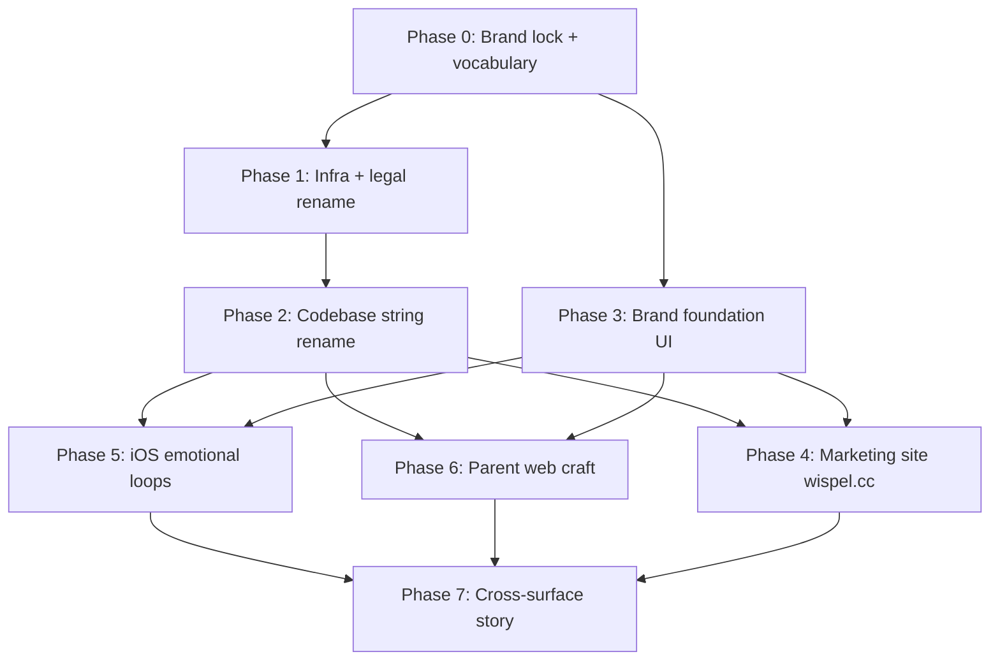

# Wispel (`wispel.cc`) — rebrand & UI improvement plan

**Status:** planning only — no implementation in this PR  
**Date:** 2026-07-30  
**Inputs:** UI review (web + iOS), productvoorstel §4, Design System kits, current `apps/web` + `apps/ios` shipping UI  
**Goal:** Rename the product from **TaakHelden** to **Wispel** on domain **wispel.cc**, and execute the critical UI recommendations so brand, marketing, and emotional product loops match the promise.

---

## 0. Brand decisions to lock before coding

| Decision | Recommendation | Owner must confirm |
| --- | --- | --- |
| **Product name** | **Wispel** (not “wispel.cc” in chrome) | Yes |
| **Domain** | `wispel.cc` — primary marketing + web app | Yes |
| **Subdomains** | `www.wispel.cc` → marketing; `app.wispel.cc` → parent dashboard; `api.wispel.cc` → Worker API | Confirm |
| **App Store display name** | Wispel | Confirm |
| **Bundle ID** | Prefer `cc.wispel.family` (or keep `nl.taakhelden.*` if already submitted — see §1.3) | Confirm |
| **Voice** | Keep positive NL child copy (§3.7); invent Wispel-native hero language to replace “TaakHeld(en)” | Confirm |
| **Mascot** | Decide: revive “Vinkie” under Wispel, or design a new Wispel mascot — do not ship emoji-as-mascot | Confirm |
| **Tagline direction** | Playful Dutch fit (“wispelen” = fidget/play) — one short parent promise, not a slogan pile | Marketing |

### Naming glossary (use everywhere user-facing)

| Old | New |
| --- | --- |
| TaakHelden | Wispel |
| taakhelden.nl / workers.dev staging hosts | wispel.cc (+ staging hosts) |
| “TaakHeld” (level / celebration copy) | New Wispel term (e.g. “Wispelaar” / “Held van vandaag” — **pick one** in Phase 0) |
| Email from / legal entity strings | `@wispel.cc` |

### What does *not* need to rename on day one

- Cloudflare **resource IDs** (D1 `database_id`, R2 bucket contents) — rename *bindings/names* carefully; IDs stay.
- Historical git history / merged PR titles.
- ADR filenames can keep numbers; update *content* to say Wispel.
- Internal Cursor agent ids (`taakhelden-*`) — optional follow-up; not user-facing.

---

## 1. Phase map (order is intentional)

| Phase | Outcome | Depends on |
| --- | --- | --- |
| **0** Brand lock | Name, domain map, hero vocabulary, palette brief, logo brief | — |
| **1** Infra rename | DNS, Workers, Apple ids, email, secrets | Phase 0 |
| **2** Codebase rename | All user-facing + package/worker display names say Wispel | Phase 1 decisions |
| **3** Brand foundation | Real mark, final palettes, icon/avatar system | Phase 0 brief |
| **4** Marketing | Public `wispel.cc` landing that passes the brand test | Phase 2 + 3 |
| **5** iOS loops | Shop redeem, Mijn Dag hero, Mijn Held, age modes | Phase 2 + 3 |
| **6** Web craft | Less card noise, primitives, Inzichten ship-or-hide, motion | Phase 2 + 3 |
| **7** Cross-surface | Shared celebration language, kits ↔ shipping aligned | Phase 5 + 6 |

Do **not** polish bordered lists before Phase 0–3. Identity first, then loops, then craft.

---

## 2. Phase 0 — Brand lock (design + product, little code)

### 2.1 Deliverables
1. **One-pager brand sheet:** name, pronunciation, do/don’t, parent promise (1 sentence), child promise (1 sentence).
2. **Visual brief:** final kid / teen / parent hex; when yellow is used; shared kinship rule (same mark + family accent across registers).
3. **Logo brief:** wordmark + optional mark; light/dark; app icon variants.
4. **Vocabulary table:** replace every “TaakHeld(en)” string with Wispel equivalents (NL + EN).
5. **Illustration brief:** avatar system (not emoji), task category icons, optional mascot.

### 2.2 Hard rules from the UI review (carry into the brief)
- Parent register stays calm (no coral chrome, no confetti in dashboard chrome).
- Kid register stays warm/round; teen must change radius/type/ornament — not only navy fill.
- No purple-on-white / cream-serif terracotta clichés on marketing.
- Landing first viewport: brand + one headline + one sentence + CTA + one dominant product visual — nothing else.

### 2.3 Exit criteria
- Stakeholders signed off on glossary + palette + logo direction.
- Copy spreadsheet ready for eng to find-replace user strings.

---

## 3. Phase 1 — Infrastructure & legal rename

### 3.1 Domain & DNS (`wispel.cc`)
| Host | Purpose |
| --- | --- |
| `wispel.cc` / `www` | Marketing landing (Phase 4) |
| `app.wispel.cc` | Next.js parent dashboard |
| `api.wispel.cc` | Hono Worker `/v1` |
| Optional `cdn` / R2 custom domain | Presigned photo URLs later |

Also: SPF/DKIM/DMARC for transactional mail from `@wispel.cc`.

### 3.2 Cloudflare Workers / bindings
Current → target (staging then prod):

| Current | Target |
| --- | --- |
| Worker `taakhelden-api` | `wispel-api` |
| Worker `taakhelden-web` | `wispel-web` |
| D1 `taakhelden-db` | `wispel-db` (new name; same data via migration/copy — **do not rewrite historical migrations**) |
| R2 `taakhelden-photos` | `wispel-photos` (or keep bucket, change public naming only) |
| `APP_BASE_URL`, service bindings, `API_BASE_URL` | Point at `*.wispel.cc` |

Document rollback: keep old Workers names as aliases until DNS cutover is green.

### 3.3 Apple / App Store
| Item | Action |
| --- | --- |
| Display name | Wispel |
| Bundle ID | New `cc.wispel.family` **only if not yet live**; if App Store record exists under `nl.taakhelden.*`, keep bundle ID and change display name only |
| SIWA Services ID / redirect URLs | Update to `wispel.cc` / `app.wispel.cc` |
| Associated Domains / Universal Links | `applinks:wispel.cc`, `applinks:app.wispel.cc` |
| Privacy policy / support URLs | Host on `wispel.cc` |

### 3.4 Exit criteria
- Staging API + web reachable on Wispel hosts.
- SIWA / email smoke tests pass against new domains.
- Bundle ID strategy written in an ADR.

---

## 4. Phase 2 — Codebase rename (systematic)

Work in **small PRs** to keep CI green. Suggested order:

### PR A — User-facing strings only
- `apps/web/messages/{nl,en}.json`
- Auth pages wordmark / metadata titles
- iOS `Localizable.xcstrings` / `String(localized:)` catalogs
- Email templates (`apps/api/src/services/email.ts`, notifier copy)
- Privacy / settings legal strings that name the product

### PR B — App chrome & packaging
- `apps/web` metadata, Open Graph, `layout.tsx` titles
- `apps/ios/project.yml` `PRODUCT_NAME`, scheme names (folder rename optional later)
- Design System wordmark specimens
- `docs/*` product name references (canonical docs first; batch history can stay)

### PR C — Package / Worker / repo identifiers
- Root `package.json` name → `wispel`
- `wrangler.toml` / `wrangler.jsonc` worker names + env URLs
- OpenAPI title (`TaakHelden core API` → `Wispel core API`)
- Shared package display strings; regenerate Swift contract
- CI workflow display names

### PR D — Repo / path renames (optional, highest risk)
- `apps/ios/TaakHelden/` → `apps/ios/Wispel/` (XcodeGen + CI paths)
- Doc filenames `taakhelden-*.md` → `wispel-*.md` with redirects/links updated
- Only after A–C are stable

### Rename inventory (non-exhaustive; eng must `rg`)

| Area | Examples |
| --- | --- |
| Web UI | Login `h1`, AppShell brand, metadata |
| iOS | `PRODUCT_NAME`, unlock/welcome titles, widget |
| API | OpenAPI title, email subject lines, push payloads |
| Infra | Worker names, `APP_BASE_URL`, Apple client ids |
| Docs / DS | Productvoorstel header, Design System readme |
| Tests | Assertions on product name strings |

### Exit criteria
- `rg -i 'taakhelden|TaakHelden'` returns **zero user-facing** hits (code comments/history OK if documented).
- Typecheck + test suites green; iOS scheme builds as Wispel.

---

## 5. Phase 3 — Brand foundation UI (P0 from review)

Maps to review recommendations **1–3**.

| # | Work item | Surfaces |
| --- | --- | --- |
| 3.1 | Implement logo/mark (SVG web + PDF/PDF asset iOS + App Icon set) | Web, iOS, marketing |
| 3.2 | Promote kid/teen hex from “placeholder” → final in `globals.css`, Design System tokens, `THPalettes` | Shared tokens |
| 3.3 | Kinship rule in CSS/Swift: shared accent + mark; parent calm / kid warm / teen muted | Both |
| 3.4 | Icon set for chrome (stroke, rounded); retire emoji for UI chrome | Both |
| 3.5 | Avatar illustration library v1 (diverse; wheelchair/glasses/gender-neutral) | iOS first |
| 3.6 | Use yellow intentionally (streaks, milestones) — not as random fill | iOS + DS kits |

### Exit criteria
- Brand test: remove nav chrome on marketing/auth — still recognizably Wispel.
- `globals.css` no longer labels kid/teen as placeholder.
- Design System readme updated to “shipping brand”, not “inferred”.

---

## 6. Phase 4 — Marketing site on `wispel.cc` (P1)

Maps to review recommendations **4–6**.

### 6.1 Routes
| Route | Purpose |
| --- | --- |
| `/` (or locale `/nl`, `/en`) | Landing — brand-first hero |
| `/privacy`, `/voorwaarden` | Legal (App Store + AVG) |
| `/login` → `app.wispel.cc/...` | Deep link / redirect to dashboard |
| Optional `/prijzen` | Freemium story — only after pricing lock |

### 6.2 Landing composition (hard constraints)
- **One composition** in first viewport: Wispel mark (hero-level) + one headline + one supporting sentence + CTA group + **one full-bleed product visual** (child phone / family moment).
- No cards in hero; no stat strips; no pill clusters; no overlay badges on hero media.
- Expressive type (not Inter/system for marketing); atmosphere via gradient/pattern/image — not flat white.
- CTA: “Start met je gezin” → register on `app.wispel.cc`.
- Secondary: App Store badge when iOS build is public.

### 6.3 Auth upgrade
- Replace flat centered form with branded entry (atmosphere + mark + one promise line).
- Keep parent calm register — do not paste kid coral into login chrome.
- Language switcher available on auth (today missing).

### 6.4 App Store / Welcome
- Welcome hub shows a short preview of kid warmth (cream/coral/celebration) while remaining family/parent-led for SIWA.

### Exit criteria
- `wispel.cc` loads landing on mobile + desktop.
- Auth no longer fails the brand test.
- SEO basics: title/description NL+EN, OG image with mark.

---

## 7. Phase 5 — iOS emotional loops (P2)

Maps to review recommendations **7–11**.

| Priority | Item | Detail |
| --- | --- | --- |
| 5.1 | **Winkel complete** | Redeem CTA (API already exists), affordability, **spaardoel** ProgressBar (“Nog X tot …”), RewardCard grid |
| 5.2 | **Mijn Dag hero header** | Avatar + points + streak (match product §4.1 + DS kit) |
| 5.3 | **Mijn Held elevate** | Milestone badges, clearer level story, less parent-gate-as-hero |
| 5.4 | **Teen differentiation** | Radius ~12, system/default type bias, mint confetti, less ornament |
| 5.5 | **Young mode pass** | Near-textless, picture-first, TTS-first, large targets — before marketing 4–7 |
| 5.6 | **Pairing polish** | Large code boxes + QR (bouwvoorstel), numeric pad consistency |

### Exit criteria
- Child can browse → save toward → redeem a reward end-to-end.
- Mijn Dag header matches kit composition.
- Teen and young modes pass a visual QA checklist (separate from mid).

---

## 8. Phase 6 — Parent web craft (P3)

Maps to review recommendations **12–15**.

| Priority | Item | Detail |
| --- | --- | --- |
| 6.1 | Reduce border/card monotony | Borders only where interaction needs a container; clearer Vandaag hierarchy |
| 6.2 | Primitive consistency | Use `Button` / `Badge` / `ProgressBar`; wire or delete dead kid components |
| 6.3 | **Inzichten: ship or hide** | Remove from nav until Batch/Fase 2 ships; never leave stub in primary nav |
| 6.4 | Intentional motion (2–3) | Approval success, reward fulfilled — quiet echo of celebration, not kid confetti |
| 6.5 | Empty states | Illustration + Wispel voice; keep positive framing |

### Exit criteria
- No primary-nav stubs.
- Lint/design-check: no new raw hex where tokens exist; primitives used.
- Parent UI still calm — no kid register bleed.

---

## 9. Phase 7 — Cross-surface story (P4)

Maps to review recommendations **16–18**.

1. **Align Design System kits ↔ shipping** — update kits to Wispel brand; mark aspirational screens clearly OR bring shipping up to kit.
2. **Shared celebration language** — when parent approves / fulfills on web, show a restrained success moment that *echoes* iOS (color flash / check), not a different personality.
3. **Inzichten tone** — conversation-help layout, never surveillance dashboard (when shipped).
4. **Docs hygiene** — CLAUDE.md, AGENTS.md, Design System readme, productvoorstel header all say Wispel + `wispel.cc`.

### Exit criteria
- New designer/engineer reading DS + apps sees one brand.
- Marketing screenshots match the live app within one release.

---

## 10. Explicit non-goals / anti-patterns

- Do not coral-wash the parent dashboard.
- Do not ship a teal SaaS template landing with a wordmark swap.
- Do not treat DS kits as “done” while production lags.
- Do not rewrite historical D1 migrations; add new numbered migrations only.
- Do not market to 4–7 until young-mode pass lands.
- Do not change ledger / no-negative-mechanics rules as part of rebrand.

---

## 11. Workstream ownership (suggested)

| Workstream | Primary agents / roles |
| --- | --- |
| Brand lock + copy | Product Owner + Marketing + `@dutch-child-copy` |
| Domain / Workers / DNS | `@taakhelden-devops` (rename later) |
| String rename web | `@taakhelden-web` + `@taakhelden-i18n` |
| String rename API / email | `@taakhelden-backend` |
| iOS rename + loops | `@taakhelden-ios` |
| Design tokens / UI craft | `@taakhelden-web` + design-system skill + `/design-check` |
| Landing page | `@taakhelden-web` + `@taakhelden-marketing` + `@taakhelden-seo-reviewer` |
| Docs / ADRs | `@taakhelden-knowledge` + `@taakhelden-architect` |
| Security of new domains / SIWA | `@taakhelden-security` |

---

## 12. Suggested PR / release sequence

1. **Docs:** this plan + ADR for bundle ID / domain map  
2. **Phase 0** artifacts in `Design System/` (palette + wordmark cards)  
3. **Phase 1** staging cutover on Cloudflare  
4. **Phase 2A–C** rename PRs  
5. **Phase 3** brand assets wired into web + iOS  
6. **Phase 4** landing on `wispel.cc`  
7. **Phase 5** iOS shop + hero + held (can parallelize with 6 after 3)  
8. **Phase 6** web craft + hide Inzichten  
9. **Phase 7** kit sync + celebration echo + doc sweep  
10. **Prod DNS cutover** + App Store metadata update  

---

## 13. Success metrics (qualitative + light quantitative)

| Signal | Target |
| --- | --- |
| Brand test (landing/auth) | Pass without relying on nav alone |
| Child redeem funnel | Browse → pin → redeem works on device |
| Parent trust | No stub nav items; calm register intact |
| Name consistency | Zero user-facing “TaakHelden” in app/web/email |
| Store / web first impression | Wispel mark + promise readable in &lt;3s |

---

## 14. Open questions (block Phase 0)

1. Exact hero vocabulary replacing “TaakHeld” — keep hero metaphor or go fully Wispel-native?
2. Bundle ID: new `cc.wispel.*` vs keep `nl.taakhelden.*`?
3. Mascot: keep Vinkie, redesign, or postpone?
4. Marketing on same Next.js app (`apps/web`) vs separate marketing Worker/Pages project?
5. Staging hostname: `staging.wispel.cc` vs keep `*.workers.dev` until prod?

---

## Appendix A — Recommendation → phase traceability

| Review recommendation | Phase |
| --- | --- |
| 1 Brand pass (logo, palettes, illustration) | 0 + 3 |
| 2 Kinship rule across registers | 0 + 3 |
| 3 Kill emoji-as-brand for chrome/avatars | 3 + 5 |
| 4 Dutch parent landing | 4 |
| 5 Upgrade auth | 4 |
| 6 Welcome / Store warmth preview | 4 + 5 |
| 7 Winkel redeem + spaardoel | 5 |
| 8 Mijn Dag hero header | 5 |
| 9 Elevate Mijn Held | 5 |
| 10 Teen differentiation | 5 |
| 11 Young-mode pass | 5 |
| 12 Reduce web card noise | 6 |
| 13 Use primitives consistently | 6 |
| 14 Ship or hide Inzichten | 6 |
| 15 Parent motion | 6 |
| 16 Align kits ↔ shipping | 7 |
| 17 Shared celebration language | 7 |
| 18 Pedagogical trust in Inzichten UI | 7 (+ later Insights build) |
| Rename product → Wispel / wispel.cc | 0–2 (+1 infra) |

## Appendix B — Current footprint (for eng)

High-signal rename targets already identified:

- `package.json` `"name": "taakhelden"`
- `apps/api/wrangler.toml` → `taakhelden-api`, `taakhelden-db`, `taakhelden-photos`, Apple ids
- `apps/web/wrangler.jsonc` → `taakhelden-web`, service binding `taakhelden-api`
- `apps/ios/project.yml` → `PRODUCT_NAME`, `nl.taakhelden.family`, API URLs
- Web login wordmark; iOS schemes `TaakHelden`
- OpenAPI title; docs `taakhelden-*.md`; Design System readme
- Email/notifier strings in `apps/api/src/services/`

Use `rg -i 'taakhelden|TaakHelden|TaakHeld'` as the living checklist until Phase 2 exit.
